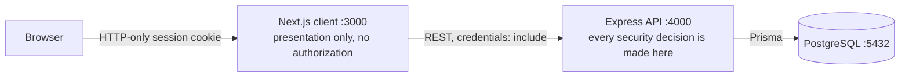
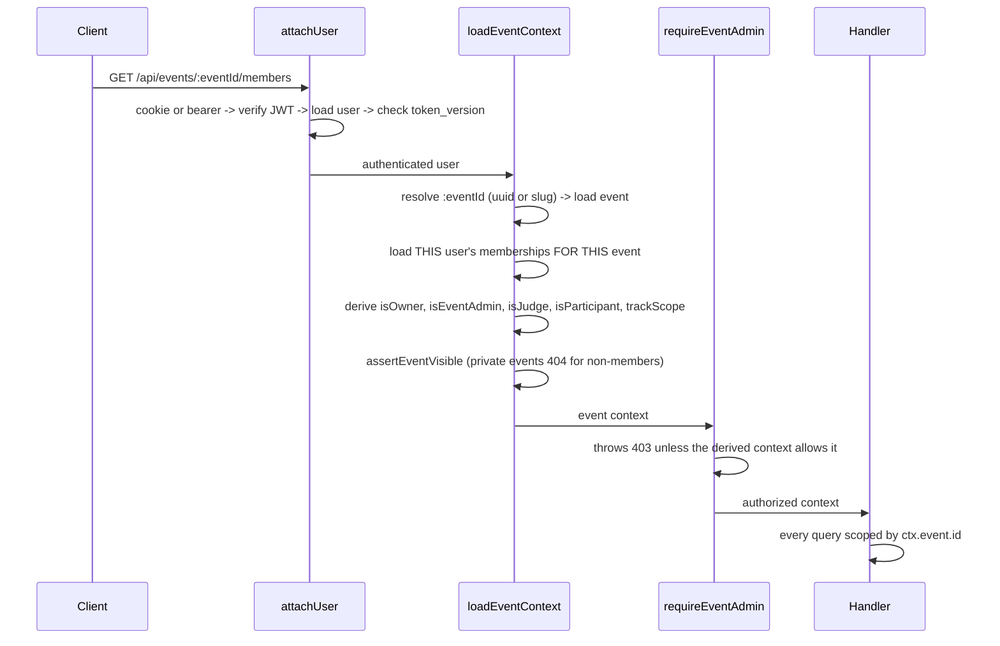
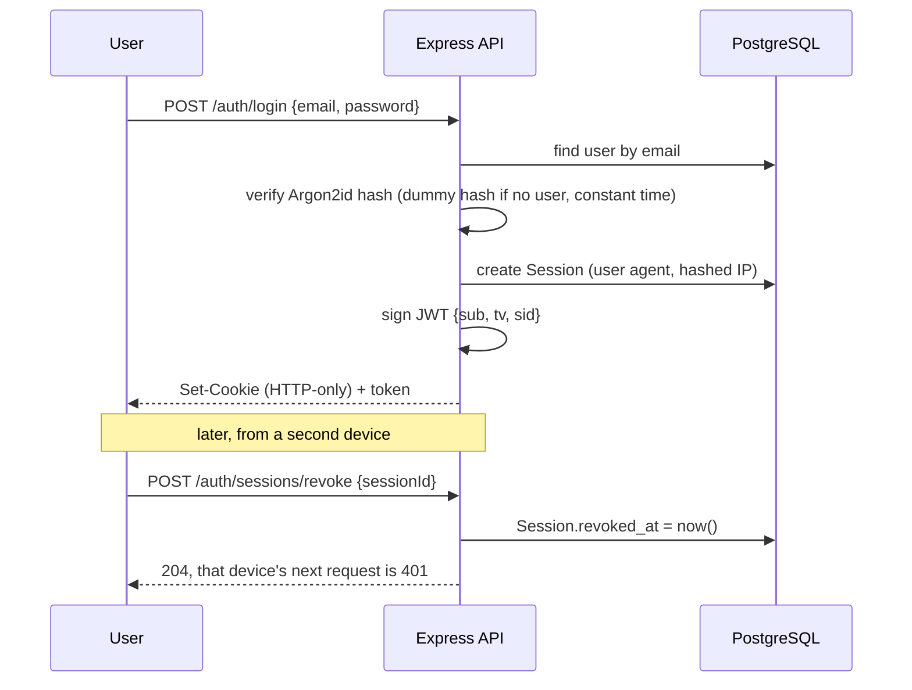
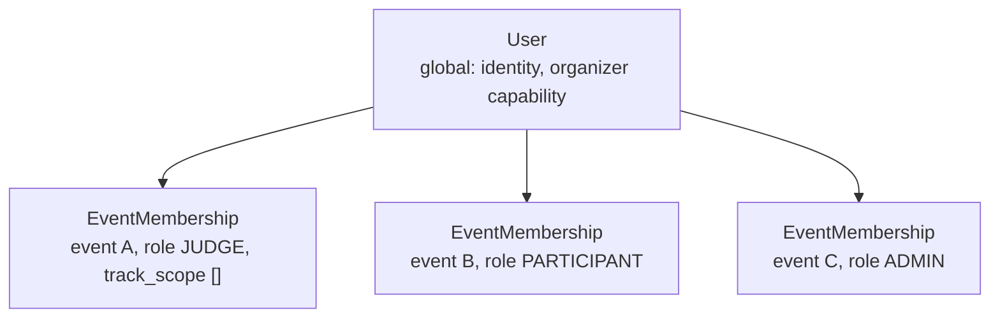
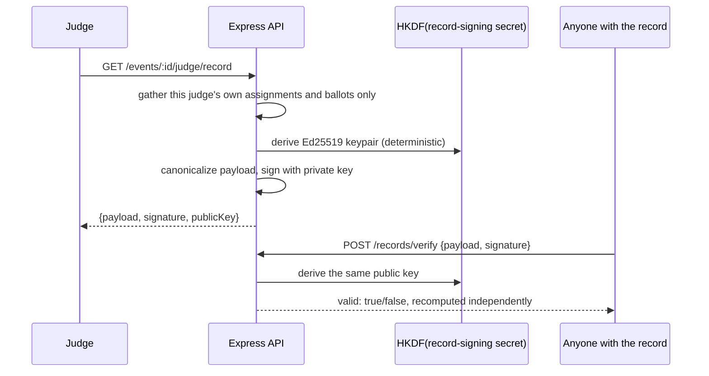

# Architecture

## Shape of the system



Three containers, nothing else. No Redis, no queue, no object storage, no external
service of any kind at runtime. That is a requirement of the brief, and it is also the
reason the rate limiter and the job-free normalization design look the way they do.

## Backend

```
routes/        HTTP surface: method, path, Zod schema, status code
middleware/    authentication, event context and RBAC, rate limiting, errors
services/      business logic, pure enough to test without HTTP
db.ts          one Prisma client for the process
```

Route handlers stay thin. They validate input, resolve the permission context and call a
service. Anything with a rule in it lives in a service, so it can be tested directly and
reused by the eventual import, export and webhook paths.

Errors are thrown, not returned. `AppError` carries an HTTP status and a stable code; a
single error middleware renders the body, so no handler reinvents the error shape.

### Request path for an event-scoped call



The important property: the context is built from the authenticated user plus the event
in the URL. A `role`, `judgeId` or `userId` in the body or query string is never read for
an authorization decision. Changing an id in a request gets you a 403 or a 404, never
someone else's data.

## Authentication

- Email and password. Argon2id (19 MiB, t=2, p=1), which is the OWASP recommendation.
- The JWT carries only `sub` (user id), `tv` (token version) and, once a device session
  exists, `sid` (session id). No roles, no email. Roles change per event and are looked up
  per request, so putting them in a token would be both wrong and stale.
- The token is set as an HTTP-only, SameSite=Lax cookie. `Secure` is driven by
  `COOKIE_SECURE` so local HTTP works and production HTTPS is correct.
- A `Bearer` header is also accepted, which is what makes the API usable from scripts and
  what the test suite uses.
- Revocation without losing per-device granularity works at two levels:
  - `users.token_version` bumped invalidates **every** token at once (password change,
    "sign out everywhere").
  - `sessions.revoked_at` invalidates **one** device without touching the others. Every
    login opens a `Session` row; `attachUser` checks it whenever the token carries a `sid`.
- Passwordless sign-in issues a single-use `SignInToken` (hashed at rest, short expiry)
  and emails nobody, because the platform sends no email: the link is shown on screen for
  a self-hosted deployment to relay however it likes.
- Login on a missing account still performs a password verification against a dummy hash,
  so response timing does not disclose whether an email is registered.



## Authorization

Two global facts about an account: it exists, and it may or may not create events
(`is_organizer`). In the interface these read as **Public** (signed out), **User** (signed in)
and **Organizer** (may create events). Everything else, including participant, judge and
admin, is a row in `event_memberships`.



`isEventAdmin` is true for the event owner, for an `ADMIN` membership, or for the
instance operator. Judges carry an optional `track_scope`: an empty array means every
track, a populated one means the judge can only ever see submissions in those tracks.

Ownership checks stack on top of role checks. Being a participant lets you edit *a*
submission; being on the owning team is what lets you edit *that* submission. Both are
checked, in that order.

## Deadline enforcement

`submissionWindow(event)` in `submission.service.ts` is the only thing that decides
whether a submission may be written. It reads the event's stored timestamps and the
server clock. Every mutating path calls it, and a rejected write is recorded as
`SUBMISSION_EDIT_REJECTED` in the audit log.

The client also renders a countdown, from `GET /submissions/window`. That is decoration.
Disabling the button in the browser changes nothing about what the server accepts.

## Audit log

Append-only, and enforced by the database rather than by convention. Each entry carries a
machine-readable action, a human-readable one-line summary, the actor, the event, the target,
the metadata (a changed ballot stores its values before and after) and a hashed client IP.

Two triggers from migration 0017 guard the table:

- **`audit_logs_chain`** (before insert) takes a per-event advisory lock, numbers the entry
  (`chain_seq`), and writes `prev_hash` and `hash = sha256(prev_hash | entry fields)`. It runs in
  the database, so no insert path, including the seed's bulk writes, can skip it.
- **`audit_logs_append_only`** (before update or delete) raises, except for the two cascades the
  schema needs: deleting a whole event, and clearing `actor_id` when an account is deleted.
  `actor_id` is outside the hash for that reason; the summary still names who acted.

`GET /events/:id/audit/verify` recomputes the chain with the same SQL function and reports the
first entry that was changed, removed or reordered. The audit screen shows the chain head: an
organizer who notes it can later prove the history was not rewritten, even by someone with
database access who disabled the triggers, because a rewrite cannot reproduce the head.

The summary exists so an organizer can read the trail in the product rather than in
`psql`. IPs are stored only as a salted hash, so the log is useful for abuse
investigation without becoming a pile of personal data.

## Rate limiting

A fixed-window counter in process memory, keyed by hashed IP. Deliberately not Redis:
the platform must run as a single API container with the network off, and an extra
stateful service to throttle a hackathon portal is not a trade worth making. The cost is
that limits are per-container.

The client IP comes from the socket unless `TRUST_PROXY` says a proxy sits in front. The
compose file publishes the API directly, so trusting `X-Forwarded-For` there would let any
client pick a fresh IP per request and walk past every limit. That is documented rather than hidden, and the abuse
protections that actually matter for voting are enforced by database constraints
instead of by counters.

## Community voting

`voting.service.ts` decides three things a client must never decide for itself.

**When.** `votingWindow(event, config)` is the single source of truth for whether a
ballot may be cast, reading the event's voting dates, its status and the config's
`enabled` flag. A ballot outside the window is refused and written to the audit log as
`VOTE_REJECTED` with the reason.

**Who.** `resolveVoter` derives a `voterKey` from the session (`user:<id>`), a supplied
address under email gating (`email:<address>`), or the hashed client IP on an open link
(`ip:<hash>`). A client cannot nominate the identity it votes as, and duplicate
detection is the `votes (event_id, submission_id, voter_key)` unique constraint rather
than an application check.

**How much.** `algorithms/voting.ts` prices a whole ballot before anything is written:
`weight^2` credits per project under quadratic voting, bounded by the event's budget.
The client's arithmetic is decoration, exactly like the submission countdown.

Casting a ballot replaces the voter's previous one inside a transaction, so re-voting
never stacks. Tallies return 403 to everyone but an event admin while the window is open
and `hideResults` is set, so early counts cannot steer later voters.

## Team board and matching

Teams looking for members, and people looking for a team, are both `SeekerListing` or
`Team.needs`/`Team.skills` rows scoped to one event. Joining is a two-step handshake
rather than an instant add: a `JoinRequest` records a direction (a seeker asking to join a
team, or a team inviting a seeker) and a status, and membership is only created once the
other side accepts it. That keeps `TEAM_MEMBER_ADDED` in the audit log meaningful: it
always follows a request both parties agreed to, never a unilateral write.

## Signed judge records

A judge who wants proof of what they evaluated, without exposing anyone else's scores,
gets a small signed document rather than a certificate image.

- The key is **derived from a dedicated record-signing secret**. On first boot the API
  generates two random secrets, one for sessions and one for records, and stores them in
  `instance_secrets` (`lib/instance-secrets.ts`); `JWT_SECRET` and `RECORD_SIGNING_SECRET`
  override them. `lib/signing.ts` runs the record secret through HKDF into an Ed25519 keypair,
  so rotating sessions never invalidates an issued record, and no instance ever signs with a
  secret that is published in the repository. Production refuses to boot on the old dev default.
- The payload is canonicalized (stable key order, no floating point) before signing, so
  the same facts always produce the same signature and a third party can recompute it.
- `GET /records/verify` exposes the public key and re-runs the check, so a record is
  verifiable without trusting the platform's own "verified" badge.



## Webhooks

Organizers register a URL and a secret per event (`Webhook`). Any event-scoped audit-log
action can be subscribed to, and `*` subscribes to all of them, including actions added
later. Account-level actions (sign-in, password changes) carry no event and are never
delivered. Each match is sent as an HMAC-SHA256-signed POST, computed over the raw JSON
body with the webhook's own secret.

Because dispatch hangs off `recordAudit`, "webhooks cover every action" reduces to "every
write is audited", which is one rule to keep instead of two lists to keep in sync.

Dispatch happens from `recordAudit` via `setImmediate`, deliberately detached from the
request that triggered it: an organizer publishing results does not wait on a third
party's server, and a slow or failing webhook cannot fail the action that caused it.
Every attempt, successful or not, is written to `WebhookDelivery` with the response status
and a truncated body, so a failure is diagnosable from the product rather than the
organizer's own server logs.

## Frontend

Next.js App Router, React 19, Tailwind. Server components fetch from the API over the
compose network and forward the viewer's session cookie (`lib/server-api.ts`), so a
server-rendered event page shows each person their own role; the embeddable gallery is the
one page that stays anonymous on purpose. Client components handle session state and forms,
and ask `GET /auth/session`, which answers a signed-out visitor with `user: null` instead
of a 401.

The design tokens come from the prototype: semantic CSS variables (`--bg`, `--sf`,
`--tx`, `--ac`, and so on) that flip between light and dark, mapped into Tailwind's
colour scale so components never hard-code a hex value.

The client has no security role. `viewer.roles` in an event response exists so the UI can
show the right things, not to permit anything. Every screen it renders is backed by an
endpoint that would refuse an unauthorized request on its own.

## Trade-offs worth naming

**Prisma over raw SQL.** Migrations, types and relation handling for free, at the cost of
some control over query shape. For a schema this size that is the right side of the
trade.

**Slug or UUID in the URL.** `loadEventContext` accepts either, so public links read well
and internal calls stay stable.

**No file uploads.** Images are URLs. Adding object storage would have broken the
offline-first requirement.

**One Postgres, no read replica, no cache.** The workload is a few hundred submissions
and a few thousand ballots. Anything more would be infrastructure for a hypothetical.

**Normalization stored, not recomputed.** A `normalization_run` snapshots the method, the
judge statistics and the resulting ranks. Published results must stay reproducible even
after more ballots arrive, and an auditor needs to see the inputs that produced a number,
not just today's recomputation.
