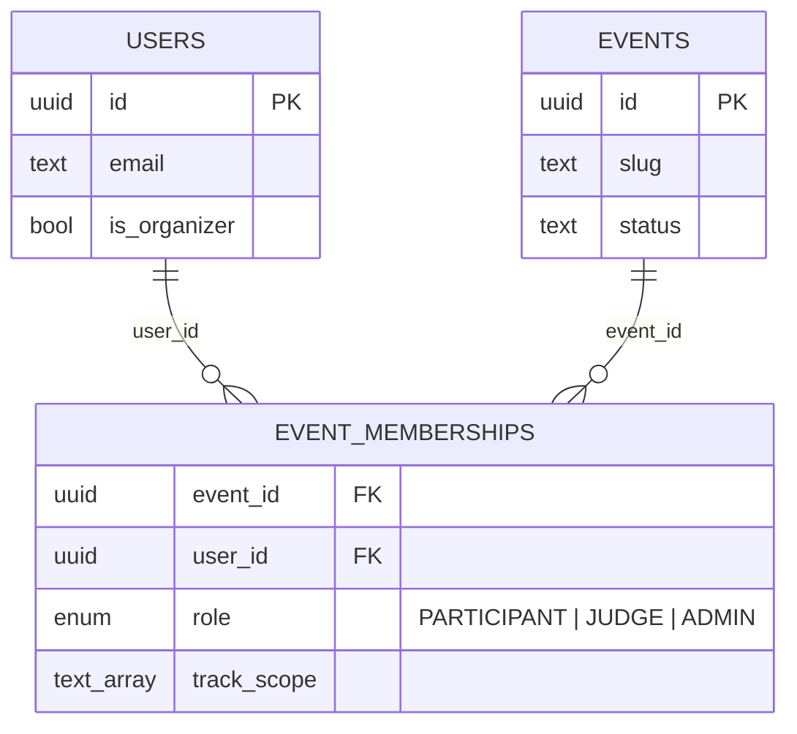
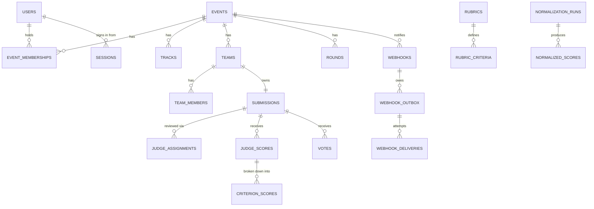

# Data model

PostgreSQL, managed with Prisma. Schema: `src/server/prisma/schema.prisma`. Migrations:
`src/server/prisma/migrations/`.

## The decision the whole schema turns on

Participant, judge and admin are **not** columns on `users`. They are rows in
`event_memberships`:



`UNIQUE (event_id, user_id, role)` is the constraint that makes this work: a user may
hold several roles in one event, but never the same role twice.

### Why

A global `users.role` column cannot express the thing this product is actually for. A
person who competes in a spring hackathon is often invited to judge the autumn one, and
the two facts are simultaneously true. With a global column you get one of three bad
outcomes: you overwrite their old role and break history, you create a second account for
the same human, or you add a pile of exception logic every time you read the column.

Making the role a property of the *relationship* removes the problem instead of managing
it. It also makes the authorization query the obvious one:

```sql
SELECT role, track_scope
FROM event_memberships
WHERE event_id = $1 AND user_id = $2;
```

That single lookup is the basis of every event-scoped permission decision in the system.
There is no path that answers "what is this user's role" without being told which event
is being asked about, because the question is meaningless without one.

The unique constraint is on `(event_id, user_id, role)` rather than `(event_id, user_id)`
deliberately: an admin who also sits on the judging panel is a real and common case, so a
user may hold several roles in one event but never the same role twice.

`track_scope` lives on the membership rather than in a join table because it only ever
qualifies a judge grant, it is read on every judge request, and it is small. A Postgres
array is the honest representation of "these tracks, or all of them if empty".

### What stays global

Identity, and `users.is_organizer` (may create events). `is_super_admin` is an instance
operator flag for platform maintenance, not an event role. Nothing else.

The interface names these global states **Public** (signed out), **User** (signed in) and
**Organizer** (`is_organizer`). "Participant", "judge" and "admin" are never account labels:
they only exist as an event membership.

## Entities



### Identity

| Table | Purpose |
| --- | --- |
| `users` | Accounts. `password_hash` is Argon2id. `token_version` enables revoking every session at once. |
| `sessions` | One row per signed-in device: user agent, hashed IP, `last_seen_at`, `revoked_at`. Lets a JWT be tied to a single device without a global session table for every request. |
| `sign_in_tokens` | Single-use, hashed-at-rest tokens behind passwordless sign-in. |

### Events

| Table | Purpose |
| --- | --- |
| `events` | The unit of scope. Owns the full timeline; every deadline check reads these columns. |
| `event_memberships` | The authorization spine, described above. |
| `tracks` | Categories within an event. `restricted` marks tracks that require an explicit judge scope. |
| `prizes` | Optionally attached to a track. |
| `custom_questions` | Organizer-defined submission questions. `stage` (`REGISTRATION` or `SUBMISSION`) decides where a question is asked; `public_answer` decides whether the answer reaches the gallery. |
| `registrations` | One row per person who registers for an event: experience level, skills, and answers to `REGISTRATION`-stage questions. |
| `rounds` | Named phases of the event (`kind`: registration, submissions, judging, voting, results, custom) with their own dates, shown on the event timeline. |
| `faq_items` | Organizer-authored, event-scoped FAQ entries. |
| `event_updates` | Organizer announcements, each with a `tag`. |
| `update_reads` | One row per `(update, user)`, so "unread" is a real per-account fact rather than a client-side guess. |

### Teams and submissions

| Table | Purpose |
| --- | --- |
| `teams` | Unique name per event. `board_track_id`, `needs` and `skills` back the team board. |
| `team_members` | `OWNER` or `MEMBER`. Unique per `(team, user)`. |
| `team_invites` | Only `token_hash` is stored; the plaintext is shown once at creation. Supports use limits, expiry and revocation. |
| `seeker_listings` | A person looking for a team: track, pitch, skills, all scoped to one event. |
| `join_requests` | The handshake between a seeker and a team: `direction` (seeker asking in, or team inviting) and `status`. Membership is only created once the other side accepts. |
| `submissions` | One per team, enforced by `team_id UNIQUE`. `locked_at` is the organizer override that sits alongside the event deadline. |
| `submission_images` | Ordered gallery images. |
| `submission_custom_answers` | Unique per `(submission, question)`. |

### Judging

| Table | Purpose |
| --- | --- |
| `rubrics` | One per event. `mode` selects rubric or comparative judging. `locked_at` freezes weights once scoring starts. |
| `rubric_criteria` | Weighted criteria. Weights are integer percentages; the service layer enforces that they sum to 100. |
| `judge_assignments` | Unique per `(judge, submission)`, so a judge is never assigned the same project twice. `position` is randomized to blunt order bias. |
| `judge_scores` | One ballot per `(judge, submission)`. `weighted_total` is computed server-side and never accepted from a client. |
| `criterion_scores` | The per-criterion values behind a ballot, so any total can be re-derived. |
| `normalization_runs` | An immutable snapshot: method, per-judge statistics, parameters, ballot count. |
| `normalized_scores` | Per-submission results for one run, with both raw and normalized ranks. |
| `pairwise_rankings` | One row per judge per comparative group: the `order` of submission ids that judge placed best to worst. Input to the Borda count; see `JUDGING.md`. |

### Public participation

| Table | Purpose |
| --- | --- |
| `voting_configs` | Per event: access mode, method, credit budget, result hiding, ballot shuffling, and which roles may vote (visitors, participants, judges, admins). |
| `votes` | One line per voter per project: weight, credits spent, hashed IP and user agent. Unique per `(event, submission, voter_key)`, so duplicate detection is a database constraint, not application code. `voter_key` is always derived server-side from the session, the gated address or the hashed client IP. |
| `comments` | Soft-hidden via `hidden_at` rather than deleted, so moderation stays auditable. |

### Operations

| Table | Purpose |
| --- | --- |
| `uploads` | Image bytes, type and SHA-256, owned by the uploader and optionally by an event. Kept in Postgres so there is no object store to run, and so backups and event exports carry the images. |
| `audit_logs` | Append-only by trigger, and hash-chained per event (`chain_seq`, `prev_hash`, `hash`). Carries a machine action, a readable summary, actor, event, target, metadata and a hashed IP. |
| `webhooks` | An organizer-registered URL and secret, per event, subscribed to specific audit actions or to `*` (all of them). |
| `webhook_outbox` | One row per notification owed to one webhook: the signed body, status (`PENDING`, `DELIVERED`, `FAILED`), attempts and the next attempt time. Its id is the delivery id receivers deduplicate on. |
| `webhook_deliveries` | One row per attempt, linked to its outbox row: attempt number, status code, error, duration. |

## Constraints that carry real weight

These are correctness guarantees, not hints:

- `event_memberships (event_id, user_id, role)` unique: no duplicate grants.
- `judge_assignments (judge_id, submission_id)` unique: no double assignment.
- `judge_scores (judge_id, submission_id)` unique: one ballot per judge per project.
- `votes (event_id, submission_id, voter_key)` unique: duplicate votes are impossible at
  the storage layer, whatever the API does.
- `submissions.team_id` unique: one submission per team.
- `teams (event_id, name)` unique: no ambiguous team names within an event.
- `rubric_criteria (rubric_id, key)` unique: stable criterion identity across ballots.
- `sessions.id` referenced by a JWT's `sid`: a revoked or missing session fails
  authentication even with an otherwise valid, unexpired token.
- `update_reads (update_id, user_id)` unique: a read receipt is written at most once.

Cascades follow ownership: deleting an event removes its tracks, teams, submissions,
ballots and audit entries. `events.owner_id` is `RESTRICT`, so an account that owns an
event cannot be deleted out from under it.

## Identifiers

UUIDs throughout, so ids can be generated without a round trip and are not guessable by
enumeration. Events additionally carry a human-readable `slug`, and event routes accept
either form. Because of that, a slug may not look like a UUID, and `new` is reserved for the
web client's creation page. `events.description` is stored as the organizer's Markdown
source and rendered on read, with raw HTML dropped.

## Migrations

```bash
npm run db:migrate:dev -- --name describe_change   # author a migration
npm run db:migrate                                 # apply (prisma migrate deploy)
```

The API container runs `prisma migrate deploy` on boot, so a fresh volume converges to
the current schema with no manual step.

## Import and export

The organisers' `fixtures.json` (kept at the repo root, next to `.dogfood.toml`) is imported on
first boot as its own event, `sample-hack-2026`, by `src/server/src/services/fixture-import.service.ts`.
The file is input, not a data model: every record lands in the ordinary tables, fixture ids
are used only to join records during the import, and nothing about the schema bends to fit
the file.

| Fixture | Stored as |
| --- | --- |
| `event` | an `events` row in the JUDGING state; `submissions_close` becomes `submission_deadline`, so the event refuses new entries and edits |
| `tracks` | `tracks` |
| `judges` | `users` plus a JUDGE `event_memberships` row whose `track_scope` is the judge's tracks |
| `teams` | `teams`, `team_members` (first member owns the team) and PARTICIPANT memberships |
| `projects` | `submissions`, status SUBMITTED, with the file's `submitted_at` |
| `scores` | a `judge_assignments` row and a `judge_scores` ballot with one `criterion_scores` row per criterion |
| criteria keys | a rubric with those criteria, 1 to 5, weighted evenly (34/33/33), because the file gives no weights |

The awkward cases are handled by rule, not by hand, and every one is written to the audit log
(`BULK_IMPORT`) and printed by the seed:

- **Duplicate submission.** A team holds one submission, the same rule the API enforces with a
  409. `prj_41` repeats `prj_07` from the same team; the earlier entry is kept, and the later one
  and its four ballots are refused.
- **Shared team names.** Three names are used by different teams. Names are unique per event, so
  the first keeps its name and the others get the fixture id appended, for example
  `StillTrail (tm_30)`. Teams are never merged.
- **Missing ballots.** Not invented. Projects keep between two and five reviews, as in the file.
- **Invalid ballots.** A repeat ballot, an unknown judge or project, or a value outside 1 to 5
  would be refused rather than coerced. The current file has none.

Fixture accounts get an id derived from their email and share the demo password, so a reseed
reproduces the same ids and the checker tokens in `.dogfood.toml` keep working. The import is
idempotent (skipped when the event exists; `SEED_FORCE=true` rebuilds it).

The seed script (`src/server/prisma/seed.ts`) also creates the hand-written demo events. It is
idempotent and only ever removes the demo data it created.

Bulk import and export are implemented as T4 work: `POST /events/:id/import/roster`
accepts a CSV with an `email` column and optional `name` and `team` columns. It creates
accounts for new addresses (with a password nobody knows; they sign in by link), grants the
role, and for participants places each row on its named team, creating the team if needed
and never breaking the one-team-per-event rule or the event's maximum team size. Rows it
cannot place are reported with a reason. `GET /events/:id/export/*` streams CSV for
submissions, teams, judges, scores, results and the audit log.

### Moving a whole event: in and out

`GET /events/:id/export/event.json` is the way out, and `POST /events/import` (or
`npm run event -- import file.json --owner you@example.org` on the server) is the way back in,
on this instance or any other:

- The export (format 2) holds every event-scoped table as plain rows, people referenced by
  email, the ballot digest, and the audit chain head with whether it verified. Webhook secrets,
  invite and API tokens and voter codes are left out.
- The import runs in one transaction. It gives every row a new id and remaps every reference
  to it. Foreign keys are read from Prisma's schema metadata (DMMF), so a new table or column is
  carried without touching the importer. Ids inside lists and JSON (track scopes, challenge ids,
  `user:` voter keys, audit metadata) are remapped too. People are matched by email, or created
  with no usable password, to sign in by link.
- A normalization run that matched the source's ballots still matches after import, so a
  published result stays published and verifiable. The audit trail is replayed into a fresh
  chain, then a `BULK_IMPORT` entry records the source event and its chain head.
- `tests/integration/event-transfer.test.ts` round-trips `fixtures.json` and checks that the copy
  ranks every project exactly as the original does.

Everything here is organizer-only and goes through the same `event_memberships` check as
everything else.
