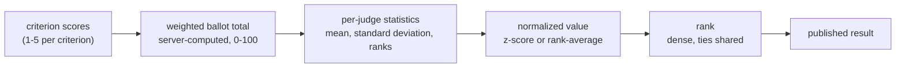
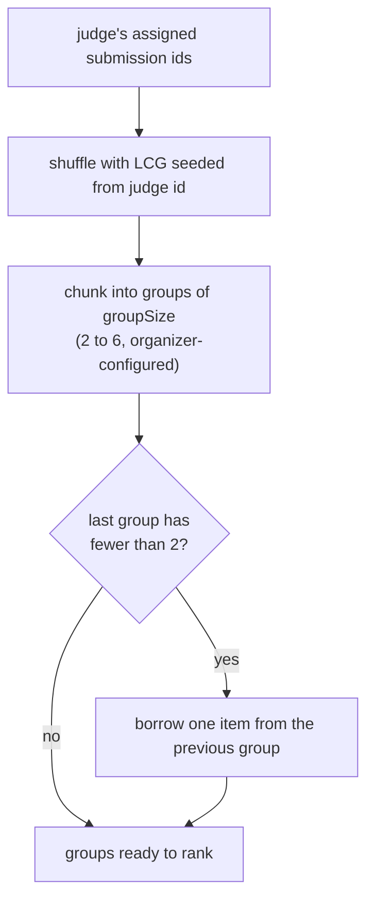
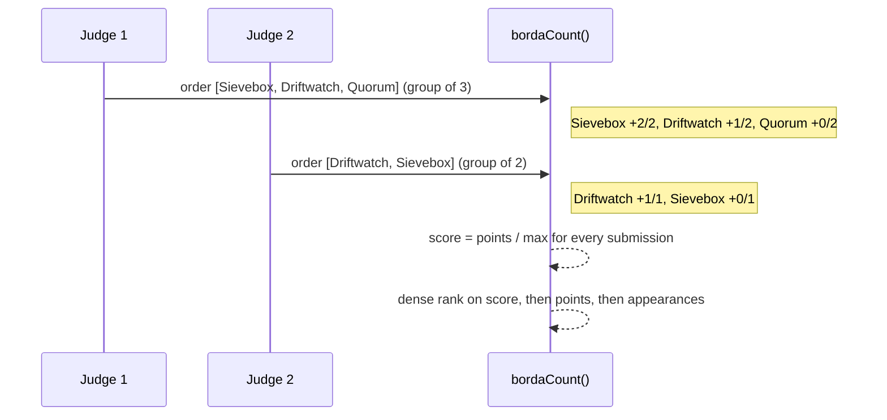
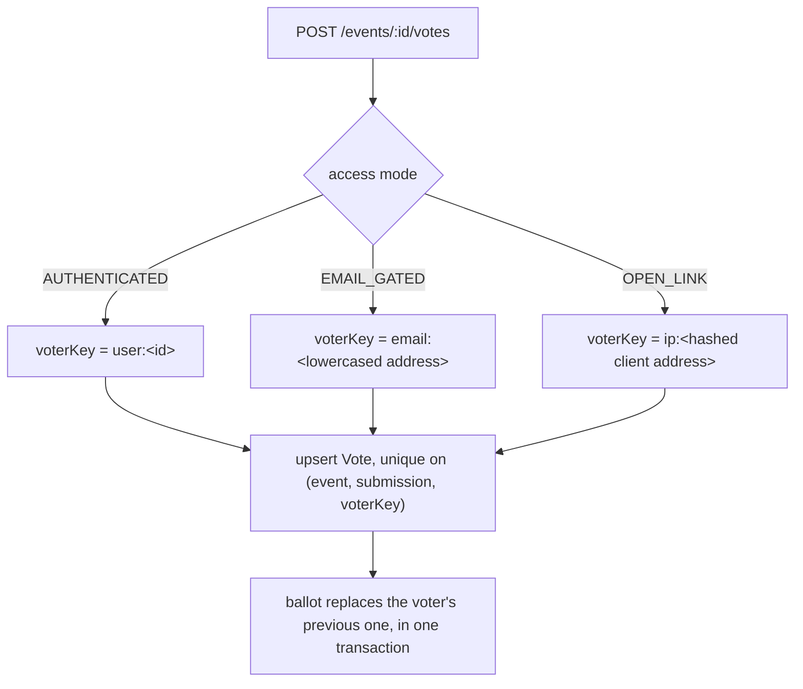

# Judging methodology

Status: the rubric model, the weighted scoring function, the assignment engine, the
normalization engine, comparative (pairwise) ranking, the judging HTTP endpoints, the
judge console and the results screen are all **implemented and covered by tests**.
`README.md` tracks anything still out of scope honestly.

## The problem worth solving

Judges do not share a scale. Given the same project, one panel member awards 4/5 because
nothing is ever a 5, and another awards 5/5 because the demo worked. Averaging their raw
scores does not measure the projects, it measures which judges a project happened to
draw.

That is the failure mode this system is built to remove, and it is why every number is
stored with the evidence that produced it.

## 1. Rubric and weighting

An organizer defines criteria, each with an integer percentage weight. Weights must sum
to exactly 100; the service layer rejects anything else, and the UI keeps Save disabled
until they do.

A typical rubric:

| Criterion | Weight |
| --- | ---: |
| Impact | 30% |
| Craft | 25% |
| Originality | 20% |
| Demo quality | 15% |
| Scope fit | 10% |

A judge scores each criterion on its configured range. The organizer picks the scale for the
whole rubric (1 to 5 by default; 3, 4, 7, 10 or any whole number from 2 to 10 in the interface,
which keeps the ballot one tap per score). Each score is first mapped onto its own range, so
changing the scale changes how fine-grained a ballot is, never how much a criterion counts.
The starting rubric is four criteria with the 40/25/20/15 weights of the DOGFOOD brief:
completion and correctness, soundness and security, ease of adoption, and code quality and
innovation. The ballot total is:

```
weighted_total = sum(score_i * weight_i) / sum(weight_i)     normalized to 0-100
```

Two rules matter here:

- **The total is computed on the server** from the stored rubric and the stored criterion
  values. A client-supplied total is ignored. A tampered request changes nothing.
- **The rubric locks when scoring starts** (`rubrics.locked_at`). Changing a weight under
  ballots that were already cast would silently rewrite history, so it is refused.

Per-criterion values are persisted in `criterion_scores`, so any total can be
re-derived from its inputs rather than trusted.

## 2. Assignment

Assignment is a constraint problem, isolated in its own service so it can be tested
without HTTP.

Constraints:

- every submission receives `reviews_per_submission` independent evaluations
- judge workload stays balanced (no judge carries a disproportionate queue)
- a track-restricted judge only receives submissions inside their `track_scope`
- no judge is assigned a submission from their own team (self-review)
- no judge is assigned the same submission twice, enforced by a unique constraint on
  `(judge_id, submission_id)` rather than by application code alone

Queue order is randomized per judge (`judge_assignments.position`). Judges are harsher
late in a queue and more generous early; a shared ordering would turn that drift into a
systematic advantage for whoever sits at the top of the list.

## 3. Normalization

Two methods, both stored, both inspectable. The organizer chooses which to publish and
can see the other side by side.



### Per-judge z-score (default)

For each judge `j`, over the ballots that judge actually cast:

```
n_j     = ballots cast by j
mean_j  = mean(totals cast by j)
var_j   = population variance(totals cast by j)
m       = mean of every ballot in the event
v       = pooled within-judge variance (judges with n >= 2 who spread their scores)

mean_j* = (n_j * mean_j + 1 * m) / (n_j + 1)          shrunk toward the panel, prior 1 ballot
sd_j*   = sqrt((n_j * var_j + 3 * v) / (n_j + 3))     shrunk toward the pool, prior 3 ballots

z(ballot) = (total - mean_j*) / sd_j*     unless j is flat (n_j >= 2 and sd_j = 0): then 0
```

A submission's normalized score is the mean of the z-scores it received. For display it
is mapped to a readable scale (`50 + 10 * z`).

This corrects for two distinct judge behaviours at once: **severity** (a judge whose mean
is low) and **spread** (a judge who uses only three of five points). A project scored 4/5
by a harsh judge and 4/5 by a generous one is not the same evidence, and after
normalization it stops being treated as if it were.

**The `sd_j = 0` case is the one that bites.** A judge who gives every project the same
total has zero discriminating information. Dividing by their standard deviation is
undefined; treating their scores as extreme is worse. Those ballots contribute `z = 0`:
they neither help nor hurt, which is the honest reading of a flat ballot set.

**Small samples are why the estimates are shrunk.** With one or two ballots a judge's own
mean and spread are mostly noise: unshrunk, a judge with a single ballot gets `z = 0` whatever
they gave, and a judge with two always gives exactly +1 and -1. On the fixture that let one
project jump from 31st to 8th on two such ballots. Shrinkage is the standard empirical-Bayes
fix: a thin judge is read mostly on the panel's scale, a well-read judge mostly on their own.
The priors (1 ballot for the mean, 3 for the variance, since variances are noisier) were
chosen on the seeded simulation, where shrinkage lifts agreement with the true order from
0.865 to 0.889 and beats the raw mean in every simulated event. Judges with fewer than three
ballots are flagged in the preview, and each project shows how many of its evaluations came
from them. See [docs/normalization-proof.md](docs/normalization-proof.md), including what the
fixture data can and cannot show.

### Rank-average

For each judge, convert their ballots to a within-judge percentile:

```
better = count of that judge's other ballots scoring higher
rank01 = 1 - better / (n_judge_ballots - 1)      when n > 1
       = 0.5                                      when n = 1
```

A submission's score is the mean of its percentiles.

This uses only the **order** a judge put projects in, discarding the magnitudes
entirely. It is robust to any monotonic quirk in how a judge uses the scale and it does
not assume the scores are interval data, which strictly speaking they are not. The cost
is real: it cannot distinguish "narrowly ahead" from "far ahead", so a runaway winner
looks the same as a close one.

### Choosing between them

Z-score is the default because a weighted rubric is designed to carry magnitude, and
throwing that away by default wastes the organizer's rubric design. Rank-average is the
right choice when the panel is small, when judges are known to use the scale very
differently, or when an organizer wants a result that cannot be argued with on
distributional grounds.

Both are computed. The organizer sees raw rank, normalized rank, and the movement
between them, because a normalization nobody can inspect is just a different opaque
number.

### What is deliberately not done

- **No cross-track normalization by default.** Different tracks attract different judges
  and different difficulty. Pooling them assumes a comparability that is not there.
- **No dropping of outlier ballots.** A judge disagreeing with the panel is data, not
  noise. Discarding it needs a stated policy, not a silent filter.
- **No weighting judges by seniority.** It is unjustifiable and unauditable.

## 4. Reproducibility

Every ranking computation writes a `normalization_runs` row capturing the method, the
per-judge statistics used, the rubric parameters and the ballot count, plus one
`normalized_scores` row per submission with both ranks.

Results are therefore reproducible after the fact. When a late ballot arrives the
published run does not silently change; a new run is created and the difference is
visible. An auditor can follow:

```
criterion scores -> weighted ballot total -> per-judge statistics
    -> normalized value -> rank -> published result
```

at every step, from stored data.

## 5. Ties and incomplete judging

**Ties.** Ranks are dense: equal normalized scores share a rank, and the next distinct
score skips accordingly (1, 1, 3). A tie is reported as a tie, never silently broken by a
hidden heuristic, because two projects the panel could not separate are information the
organizer needs rather than noise to be smoothed away.

Within a tied rank the *display order* puts more evidence first (higher ballot count),
then the higher raw mean. That affects which row is printed above the other and nothing
else: the shared rank number does not change, and resolving a tie that matters is the
organizer's decision.

**Incomplete judging.** A submission with fewer than `reviews_per_submission` ballots is
ranked on what it has, and its ballot count is shown alongside its score. It is never
silently padded with a default or an average. The organizer dashboard surfaces coverage
gaps before results are published, because the correct fix for an under-reviewed project
is another review, not a cleverer formula.

A submission with zero ballots is listed as unranked rather than assigned a bottom score.

**On the fixture data.** The imported `fixtures.json` event exercises all of this: projects
carry two to five ballots, and three judges are degenerate for z-scoring (one judge scored
three projects 4/4/4, two others cast a single ballot). Their spread is zero, so they are
flagged `degenerate` in the judge statistics and their ballots contribute without being
divided by zero. All 40 imported projects are ranked. The duplicate submission is refused at
import, so its ballots never reach the ranking; see `DATA-MODEL.md`.

## 6. Isolation

Judging integrity depends on judges being unable to see each other's work.

- A judge reads only their own assignments and their own ballots.
- `GET /events/:id/judges/:judgeId/scores` returns that judge's ballots only to that judge
  (or `me`) and to an event admin. Any other caller, including another judge, gets 403, and
  the attempt is written to the audit log as `ACCESS_DENIED`. This is the route the
  acceptance checker probes as judge B.
- A track-restricted judge cannot read a submission outside their scope, including by
  requesting it directly by id.
- Aggregate scores are organizer-only until results are published.

These boundaries get automated tests. A hidden button is not a boundary; the test is
whether `curl` with a valid session for judge A can reach judge B's data. It cannot.

## 7. Audit trail

`SCORE_SUBMITTED`, `SCORE_UPDATED`, `JUDGE_ASSIGNED`, `JUDGE_UNASSIGNED`,
`NORMALIZATION_RUN` and `RESULTS_PUBLISHED` are written to the audit log with a readable
summary, so an organizer can reconstruct what happened without a database client. A changed
ballot records its criterion values before and after. The log is hash-chained and append-only in
the database (see [ARCHITECTURE.md](ARCHITECTURE.md#audit-log)), and the Audit screen verifies
the chain on every visit.

## 8. Comparative mode

`rubrics.mode = COMPARATIVE` is the alternative to absolute scoring. Instead of rating
criteria, a judge orders a small group of projects (2 to 6, organizer-configured via
`groupSize`) from best to worst in one action.

### Group construction

A judge's assigned submissions are split into groups by `algorithms/pairwise.ts`:

- the judge's own submission list is shuffled with a PRNG seeded from their own user id
  (`seedFrom` + a linear congruential generator), so the grouping is **stable across page
  loads** for that judge without being stored anywhere or shared between judges;
- consecutive chunks of `groupSize` become groups;
- a trailing group smaller than 2 borrows one item from the previous group, because a
  group of one has nothing to compare.



### Casting a ranking

For each group the judge submits an `order`: an array of submission ids, best first. That
becomes one `PairwiseRanking` row. A judge can re-rank a group they already ranked; the
row is replaced, not appended.

### Borda count

Overlapping rankings across judges are combined with a classic Borda count. In a
submitted ranking of size `k`, the project placed first scores `k - 1` points, the next
`k - 2`, down to `0` for last:

```
points(order[i]) += (k - 1 - i)
max(order[i])    += (k - 1)          # the most that project could have scored in this group
```

A submission's final `score` is `points / max`, points as a fraction of the most it could
possibly have earned. Normalizing by `max` rather than comparing raw point totals is what
keeps a submission that appeared in five groups comparable to one that only appeared in
three: neither is punished or rewarded for how many comparisons it happened to draw.

Ranking is dense on `score`, with `points`, then `appearances`, then submission id as
deterministic tie-breakers, so equal-strength projects share a rank and the ordering
never depends on object insertion order.



### Why, and the cost

Comparative mode sidesteps calibration entirely: a judge is never asked for a number, so
there is no scale to disagree about across a panel. It needs more comparisons than rubric
scoring to separate a large field with confidence, and it produces no per-criterion
feedback for teams, which is why an organizer chooses it explicitly rather than it being
the default.

## 9. Community voting

Community voting is a separate signal from the judging panel. It never enters the
weighted rubric total or the normalization run; it is tallied on its own and presented on
its own. An organizer who wants it to affect an award does that by awarding a prize, not
by the system silently blending two different kinds of evidence.

### Methods

Two methods are supported, and they are not the same thing. **SINGLE is the default**; an organizer opts in to quadratic and must then state the budget.

**SINGLE.** A voter backs a project once, for one unit of weight, costing one credit.
The tally is a headcount. This is one person, one vote per project.

**QUADRATIC.** A voter holds a credit budget, set by the organizer when they choose this method (the API refuses a switch to quadratic that does not name one), and buys weight on a project
at a cost of `weight^2` credits:

```
credits(w) = w^2

weight 1 -> 1 credit
weight 2 -> 4 credits
weight 3 -> 9 credits
weight 5 -> 25 credits
```

A ballot is the whole set of `(project, weight)` pairs, priced together, and refused if
the total cost exceeds the budget. Backing one project with weight 3 costs 9 credits;
spreading weight 1 across three projects costs 3. The tally is the sum of weights, not of
credits.

This is deliberately **not** one person, one vote. Under quadratic voting a single voter
can contribute more than one unit of weight to a project, bounded by the budget, and the
marginal cost of intensity rises quadratically. That is the point: it lets a voter
express how strongly they feel while making it expensive to dominate a single race.

### Changing the method

The method and the credit budget decide what a ballot means, so they **lock** as soon as the poll is live (enabled and inside its window) or any ballot exists. A change is refused with a 409 and the reason, and the interface disables the controls. Other settings (hide tallies, shuffle, who may vote) stay editable. Who may vote is set per role (visitors, participants, judges, admins), and a person must have every role they hold allowed, so an admin who also registered as a participant stays out while admins are excluded. Locking after the first ballot, not only while the poll is open, is what stops a closed poll being reinterpreted.

### Tallying and ties

Projects are ranked on total weight. A tie on weight is broken in favour of the project
with more distinct voters, which prefers broad support over one voter spending a large
share of their budget. Genuinely tied rows (equal weight and equal voter count) share a
rank, as with dense ranking elsewhere in this document.

`share` is a project's weight as a fraction of all weight cast, which is what the bars in
the UI show.

### Identity and duplicate detection

Every ballot carries a `voterKey` derived server-side. A client cannot nominate the
identity it votes as.



| Access mode | Key | Strength |
| --- | --- | --- |
| `AUTHENTICATED` | `user:<id>` | Strongest. Anonymous ballots are refused. |
| `EMAIL_GATED` | `email:<lowercased address>` | Medium. The address is not verified by an email round trip, because the platform sends no email. |
| `OPEN_LINK` | `ip:<hashed client address>` | Weakest, on purpose. The rate limit is what bounds abuse here. |

Uniqueness is a database constraint, `@@unique([eventId, submissionId, voterKey])`, not
an application-level check. Re-voting replaces the voter's whole ballot inside one
transaction rather than stacking a second one.

### Anti-abuse

- **Self-voting.** A signed-in voter cannot back their own team's project. Checked
  against team membership on the server.
- **Role separation.** Judges and organizers of an event cannot cast community votes
  unless the organizer explicitly enables it, so panel and crowd stay separate signals.
- **Position bias.** Ballot order is shuffled per voter from a deterministic seed derived
  from the voter key: the same voter always sees the same order, so a reload does not
  reshuffle the page under them, while different voters see different orders.
- **Rate limiting.** Ballots are limited per hashed client address in a fixed in-process
  window. Deliberately not Redis: the platform must run with the network off.
- **Flagging, not silent rejection.** The organizer's ballot list marks lines where one
  client address carries several voter keys. Nothing is auto-rejected; the organizer
  decides.
- **Hidden results.** While the window is open, tallies return 403 to everyone but an
  event admin, so early counts cannot steer later voters.

Both `VOTE_CAST` and `VOTE_REJECTED` are written to the append-only audit log, with the
reason for a rejection, so an organizer can see abuse attempts rather than just their
absence.

### What this does not do

Email-gated voting does not prove control of the address. Open-link voting is trivially
defeated by anyone with several addresses. Neither mode is a defence against a determined
attacker, and the honest recommendation for anything that decides a prize is
`AUTHENTICATED`.
