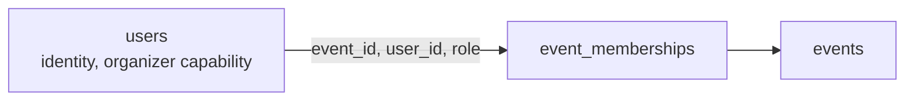

# podium

A self-hostable, open-source hackathon submission and judging platform. Registration
through teams, submissions, judging, normalization and published results, with
event-scoped RBAC, backend-enforced role isolation, configurable weighted rubrics and
offline-first operation.

Built for the [Dogfood Hackathon](https://dogfoodhack.com).

## Run it

Requires Docker. Nothing else: no cloud account, no hosted database, no API key.

```bash
git clone https://github.com/ikeshavvarshney/podium.git
cd podium
docker compose up
```

That brings up Postgres, applies migrations, seeds the demo events, imports the organisers'
`fixtures.json` as the event `sample-hack-2026`, and starts both services:

| Service | URL |
| --- | --- |
| Web client | http://localhost:3000 |
| API | http://localhost:4000/api |
| Postgres | localhost:5433 |

Once the images and npm packages are cached locally this works with the network off.

### The fixture event and the acceptance checker

`fixtures.json` sits at the repo root and is mounted into the API container. On first boot it
becomes the event `sample-hack-2026`: 8 tracks, 30 judges, 40 teams, 40 submissions and 122
ballots, with submissions already closed. The file's awkward cases are handled by rule and
logged: the duplicate submission `prj_41` is refused (with its 4 ballots), three shared team
names get the fixture id appended, and missing ballots are left missing. See
[DATA-MODEL.md](DATA-MODEL.md#import-and-export).

The checker never signs in, so the seed issues fixed API tokens for four fixture accounts
(`organizer@example.org`, judges `marek.nowak@example.org` and `mira.kaur@example.org`,
participant `priya1@example.org`). They are already in `.dogfood.toml`, along with the routes,
all on the API at port 4000:

```bash
docker compose up -d
python3 run.py .dogfood.toml
```

The tokens are public, so each only works inside the fixture event and never with organizer
capability; `FIXTURE_TOKENS=false` skips them. Session and record-signing secrets are generated on
first boot, never taken from the repository; see [docs/SECURITY.md](docs/SECURITY.md).
The checker has no T3 or T4 probes, so a T3 claim always prints as "claimed but not verified".

### Demo accounts

Every seeded account uses the password `podium-demo-2026`.

The seed also creates one event per state so every screen has data: `harbor-hack` (draft), `summit-open` (published), `lattice-jam` (registration open), `kiln-sprint` (link only), `quiet-room` (private), `podium-26` (judging), `orbit-cup` (community voting), `ledger-week` (results published) and `atlas-archive` (archived). Accounts hold different roles in different events: for example `wren@tidepool.dev` judges several, and `emeline@podium.dev` owns most while `rasmus@podium.dev` is a co-admin or owns `quiet-room`.

| Email | What they are |
| --- | --- |
| `emeline@podium.dev` | Organizer, owns the demo event |
| `rasmus@podium.dev` | Organizer, instance operator |
| `odalys@verdanto.io` | Judge on the demo event and several others |
| `anouk@sievebox.dev` | Participant, owns team Sievebox |

The judge and admin roles are not sign-in choices. They are grants an organizer makes
per event, which is the point of the permission model below.

### Configuration

Every setting has a working default in `docker-compose.yml`; `.env.example` documents each one.
The ones that matter before a real event:

| Variable | Default | What it does |
| --- | --- | --- |
| `SEED_ON_BOOT` | `true` | Seeds demo events and accounts (shared public password) and imports `fixtures.json`. Set `false` for a real event. |
| `FIXTURE_TOKENS` | `true` | Issues the acceptance checker's public tokens, scoped to the fixture event only. |
| `JWT_SECRET`, `RECORD_SIGNING_SECRET` | generated | Empty means the API generates both on first boot and keeps them in the database. Set them to manage secrets yourself (32+ characters). |
| `COOKIE_SECURE` | `false` | Set `true` behind HTTPS. |
| `POSTGRES_HOST_BIND` | `127.0.0.1` | Interface the database port publishes on. Loopback by default so Postgres is never on a public interface; set `0.0.0.0` only with a strong `POSTGRES_PASSWORD`. |
| `PUBLIC_WEB_URL`, `PUBLIC_API_URL`, `CORS_ORIGIN`, `NEXT_PUBLIC_API_URL` | localhost | Where browsers reach the web client and the API. |
| `TRUST_PROXY` | `false` | Behind a reverse proxy, a hop count or the proxy's address, so limits key on the real client. |
| `SMTP_URL`, `MAIL_FROM` | empty | Mail server for sign-in links and voting codes. Empty keeps the platform offline: messages go to the API log. |
| `RATE_LIMIT_STORE` | `memory` | `postgres` shares rate limits across several API replicas. |
| `WEBHOOK_ALLOW_PRIVATE` | `false` | Local development only: lets webhooks reach private and loopback addresses. |

Moving an event between instances: download **Exports > event.json** (or
`docker compose exec server node dist/scripts/event-transfer.js export <slug> > event.json`) and
import it from **My events > Import event**, `POST /api/events/import`, or
`docker compose exec server node dist/scripts/event-transfer.js import event.json --owner you@example.org`.

## Develop locally

```bash
docker compose up -d db          # Postgres only

cd src/server
cp ../../.env.example .env
npm install
npm run db:migrate:dev
npm run db:seed
npm run dev                      # API on :4000

cd ../client
npm install
npm run dev                      # Web on :3000
```

## Tests

```bash
docker compose up -d db         # Postgres on localhost:5433
docker exec podium-db-1 psql -U podium -c "CREATE DATABASE podium_test"
cd src/server
npm install
npm test                        # generates the Prisma client, then runs the repo-level tests/ folder
```

The connection string comes from `src/server/.env.test`, which already points at `podium_test` on
port 5433.

The suite refuses to run unless `DATABASE_URL` points at a database whose name ends in
`_test`, so a test run cannot truncate development data.

Current coverage: 438 tests across 38 files, unit and integration: authentication
(password and passwordless), device sessions, scoped API tokens and instance secrets,
event-scoped RBAC, cross-event isolation, role grants and revocation, private-event visibility,
team formation and the team board, invite-link handling, submission lifecycle, gallery search and
filter, server-side deadline enforcement, rubric and comparative (Bradley-Terry) judging, ballot
freezing and pinned publication, normalization with shrinkage, panel integrity checks, voting
(email codes, per-device open links, choice limits), webhooks (outbox, retries, SSRF guard), the
hash-chained audit log, image uploads, signed judge records, certificates, bulk import, whole-event export and
import, request hardening and sign-in limits, and the fixtures.json import replayed against the
seven acceptance checker probes.

## Permission model

A role is not a property of an account. It is a row joining an account to an event:



The same person can be a participant in one event, a judge in another and an admin in a
third, simultaneously. Every event-scoped request resolves the event, loads that user's
memberships for it, and derives permissions from the database. Nothing about identity,
role, event or ownership is ever read from the request body.

Only two things are global: identity, and the organizer capability (may create events).

See [ARCHITECTURE.md](ARCHITECTURE.md) for the request path and
[DATA-MODEL.md](DATA-MODEL.md) for why the schema is shaped this way.

## Tier status

Claimed honestly in `.dogfood.toml`: T1, T2, T3 and T4. The organisers' checker (`run.py`) verifies T1 and T2, all seven probes passing in [acceptance-report.txt](acceptance-report.txt); it has no T3 or T4 probes, so those claims rest on the 438 integration and unit tests and on the manual walkthrough in [docs/MANUAL-TESTING.md](docs/MANUAL-TESTING.md).

| Tier | Status |
| --- | --- |
| T1 Core | Complete. Auth (password and passwordless), event-scoped roles, events, tracks, prizes, teams, invites, the team board, submissions, deadline enforcement, public gallery with search and filters. |
| T2 Judging | Complete. Configurable weighted rubrics, judge assignment (manual and auto-balanced), judging console, server-enforced isolation, progress dashboard, cross-judge normalization with small-sample shrinkage, panel integrity checks (lockstep judges, outlier ballots, conflicts), ballots frozen on publication and results pinned to a ballot digest, CSV export, a hash-chained audit log the database keeps append-only. |
| T3 Public | Complete for voting. One person, one vote by default (the organizer can allow several votes each, or any number for approval voting), votes changeable until the poll closes or final once cast, quadratic voting as an option with an organizer-set credit budget (locked once the poll is live), three access modes (signed in, email proved by a one-time code, open link with one ballot per browser and a per-address cap), hidden tallies, per-voter ballot shuffling, duplicate detection, rate limiting, organizer ballot inspection. Gallery comments with organizer moderation. |
| T4 Stretch | Complete. REST API covering everything the UI does, with scoped API tokens, plus CSV export and whole-event JSON export that imports back into any instance, bulk roster import that creates accounts and teams, webhooks for every event-scoped action (replay-safe HMAC signatures, a retrying outbox, SSRF guard), image uploads, an embeddable public gallery, certificate generation and signed/publicly verifiable judge participation records. A published OpenAPI 3.1 document at [docs/openapi.json](docs/openapi.json), also served at `/api/openapi.json`, generated from the live routes and validators. |

### Bonus challenges

All four are claimed in `.dogfood.toml` (`bonus`), each backed by code, tests and a document.

| Challenge | What backs the claim |
| --- | --- |
| Normalization Proof | A seeded simulation of 500 events shows shrunk per-judge standardization recovers the true order better than the raw mean (mean Spearman 0.749 to 0.889, better in every event). On `fixtures.json` it shows raw scores, normalized scores and the rank movements, and the judge effect falls from 27% of variance to 3.5%. Reproduced by `npm run proof` in `src/server/` and asserted by `tests/unit/normalization-proof.test.ts`. [docs/normalization-proof.md](docs/normalization-proof.md) |
| Pairwise Mode | Comparative judging as an alternative to the rubric: judges order groups of projects (group size 2 is classic Gavel-style pairwise: which of these two is better), and the global ranking is recovered with a Bradley-Terry fit (MM algorithm, `algorithms/bradley-terry.ts`), with Borda shown beside it. On the same simulation it recovers the true order better than Borda (0.854 against 0.827). [JUDGING.md](JUDGING.md#8-comparative-mode) |
| Threat Model | Actors, assets, trust boundaries and STRIDE, then the five named abuse cases (Sybil accounts, ballot stuffing, submission scraping, judge collusion, deadline gaming), each marked stopped, reduced or not addressed, with the code behind it and what remains open. [docs/SECURITY.md](docs/SECURITY.md) |
| API First | Every UI action goes through the REST API; the web client has no private back channel. An OpenAPI 3.1 document (159 operations) is generated from the live routes and their Zod validators, served at `/api/openapi.json` and committed at [docs/openapi.json](docs/openapi.json), and a test fails if the two drift. Scoped API tokens make it usable from scripts. [docs/API.md](docs/API.md) |

### What works right now

- Email/password authentication, Argon2id hashing, JWT in an HTTP-only cookie
- Passwordless sign-in via a single-use link, emailed when `SMTP_URL` is set and written to
  the API log otherwise
- Per-device sessions: list every signed-in device, revoke one, or revoke every session
  but the current one
- Token revocation via a per-user token version, on password change and on demand
- Profile self-service: name, organization, pronouns, bio, link, avatar colour,
  in-app notification preferences, own activity feed
- Event creation wizard: required basics, a square logo and a banner, round cards for
  registration, submissions and judging plus any rounds the organizer adds, and a
  registration-form step; then editing, timeline validation, publication and visibility
- Event-scoped participant / judge / admin roles, with admins limited to chosen areas or given full access
- Tracks, prizes, organizer-defined custom questions staged by registration or submission
- Registration: team-or-solo, and a form the organizer shapes: organization, role, track,
  experience and skills each required, optional or off, plus custom questions (short or long
  answer, link, single or multiple choice, yes or no), and the rules and code of conduct
- Team formation, invite links (stored hashed, shown once), transfer and leave
- Team board: seekers list themselves, teams list open seats, a join-request handshake
  on both sides
- Submissions: draft, edit, submit, withdraw, organizer lock, full version history
- Flagging: an organizer removes a project from public view with a reason; it leaves the
  gallery, judge queues, voting, results and winners but stays stored, and can be restored
- Server-side deadline enforcement, with rejected edits written to the audit log
- Public gallery with search, track filter, tag filter and facets
- Organizer-authored event rounds/timeline and FAQ; rounds open and close from the Rounds
  page, each change confirmed
- Every time is shown in UTC and every amount in US dollars
- Configurable weighted rubrics, refused unless the weights total exactly 100
- Comparative (pairwise) judging as an alternative to rubric scoring: judges order small
  groups of projects, ranked by a Bradley-Terry fit of the pairwise wins (Borda shown beside it).
  See `JUDGING.md`.
- Judge assignment: manual, and a deterministic least-loaded auto-balancer that respects
  the review target and the no-self-review rule
- Judging console with per-criterion scoring; the weighted total is computed server-side
- Judge isolation: a judge reads only their own queue and their own ballots
- Organizer progress dashboard: who has started, who has not, coverage per project
- Cross-judge normalization (per-judge z-score and rank-average), stored as immutable runs
- Published results, winners page, and CSV/JSON export of everything
- Community voting: quadratic or single, three access modes, a per-role choice of who may
  vote (visitors, participants, judges, admins), per-voter ballot order, self-vote refusal,
  duplicate detection in the database, hidden tallies until close
- Organizer-chosen event links, checked for availability as they are typed, and Markdown
  event descriptions with a live preview (raw HTML is never rendered)
- Announcements per event with tags and per-user read receipts
- Hash-chained, database-enforced append-only audit log, verifiable from the Audit screen, covering auth, roles, teams, submissions, judging, voting and
  deadline rejections
- Rate limiting on authentication, writes, invite acceptance and ballots
- Bulk roster import from CSV (`email`, `name`, `team`): creates missing accounts, grants the
  role and places participants on teams; CSV/JSON export of submissions, teams, judges,
  scores, results and the audit log; a whole event exports to JSON and imports back into this
  or another instance (`POST /api/events/import`, or `npm run event` on the server)
- Webhooks: organizer-registered URLs receive HMAC-SHA256-signed deliveries for any
  event-scoped audit action, or all of them with `*`. Signatures bind a timestamp and delivery
  id against replay; deliveries are queued and retried with backoff; internal addresses are
  refused; every attempt is recorded and any delivery can be retried from the settings page
- Signed, publicly verifiable judge participation records, and an embeddable public
  gallery for an event
- Certificates once the winners are announced: participation for everyone, achievement for
  the top three and track winners, downloadable as PNG or PDF and verifiable at `/verify`

### Known limitations

- Webhook retries stop after six attempts over about two and a half hours; after that a
  delivery is marked failed and waits for a manual retry.
- Collusion checks flag lockstep judge pairs, outlier ballots and same-organization assignments, but cannot prove intent, and the gallery's read limit slows a crawler rather than stopping one spread across many addresses; see [docs/SECURITY.md](docs/SECURITY.md).
- Uploads are images only (PNG, JPEG, GIF, WebP, 2 MB each after the browser shrinks them to
  WebP, 50 MB per person per day) and live in Postgres, which suits a hackathon's few hundred
  images; a much larger archive would want object storage. An identical re-upload is reused,
  and uploads never tied to an event are deleted after a day.
- Email goes out only when `SMTP_URL` points at a mail server. Without one (the offline default)
  sign-in links and voting codes are written to the API log for the operator to relay, and team
  invite links are shown on-screen. Accounts created by a roster import sign in by link.
- Rate limits live in process memory by default. Running more than one API replica, set
  `RATE_LIMIT_STORE=postgres` to share them through the database. Behind a reverse proxy, set `TRUST_PROXY` (a hop count or the proxy's address) so limits
  key on the real client; left unset, `X-Forwarded-For` is ignored because a client could forge it.
- `npm audit` reports no advisories in either package. The Prisma CLI's `deepmerge-ts` is pinned to its fixed major with an npm `overrides` entry until Prisma 7.

## Layout

```
src/
  server/          Express, TypeScript, Zod, Prisma (its own package)
    src/routes        HTTP surface and validation
    src/services      business logic, independently testable
    src/algorithms    assignment, scoring, normalization, ranking, voting
    src/middleware    auth, event context and RBAC, rate limits, errors
    prisma/           schema, migrations, seed
    scripts/          OpenAPI generator, normalization proof
  client/          Next.js 15, React 19, TypeScript, Tailwind (its own package)
tests/             unit and integration tests, run from src/server with npm test
docs/              API.md, SECURITY.md, openapi.json, normalization-proof.md, roles/
ARCHITECTURE.md  DATA-MODEL.md  JUDGING.md
docker-compose.yml  LICENSE  .dogfood.toml
```

## Documentation

| Document | What it covers |
| --- | --- |
| [ARCHITECTURE.md](ARCHITECTURE.md) | System shape, request path, auth and sessions, authorization, webhooks, signing, trade-offs |
| [DATA-MODEL.md](DATA-MODEL.md) | Entities, constraints, why roles are event-scoped, migrations, import/export |
| [JUDGING.md](JUDGING.md) | Rubric weighting, assignment, normalization maths, comparative Bradley-Terry and Borda ranking, ties, isolation, voting |
| [docs/API.md](docs/API.md) | Route map, conventions, a worked cross-event authorization example |
| [docs/SECURITY.md](docs/SECURITY.md) | Threat model, trust boundaries, STRIDE, the five named abuse cases (stopped, reduced or not addressed), known limitations |
| [docs/openapi.json](docs/openapi.json) | OpenAPI 3.1 document, also served at `/api/openapi.json`; regenerate with `npm run openapi` in `src/server/` |
| [docs/normalization-proof.md](docs/normalization-proof.md) | The reproducible experiment behind the Normalization Proof bonus |
| [docs/roles/](docs/roles) | What a user and an organizer can do, and how roles are granted |

## Licence

MIT. See `LICENSE`.

Fonts are self-hosted and load no CDN at runtime. All four are SIL Open Font Licence (OSI-approved), fetched at build time through `next/font/google`: Jost (headings), DM Sans (text), Playfair Display (accent) and JetBrains Mono (labels).
