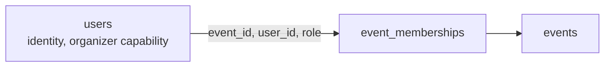

# podium

A self-hostable, open-source hackathon submission and judging platform. Registration
through teams, submissions, judging, normalization and published results, with
event-scoped RBAC, backend-enforced role isolation, configurable weighted rubrics and
offline-first operation.

Built for the [Dogfood Hackathon].

## Run it

Requires Docker. Nothing else: no cloud account, no hosted database, no API key.

```bash
git clone <this-repo>
cd podium
docker compose up
```

That brings up Postgres, applies migrations, seeds the demo events, imports the organisers'
`fixtures.json` as the event `sample-hack-2026`, and starts both services:

| Service | URL |
| --- | --- |
| Web client | http://localhost:3000 |
| API | http://localhost:4000/api |
| Postgres | localhost:5433 |

Once the images and npm packages are cached locally this works with the network off.

### The fixture event and the acceptance checker

`fixtures.json` sits at the repo root and is mounted into the API container. On first boot it
becomes the event `sample-hack-2026`: 8 tracks, 30 judges, 40 teams, 40 submissions and 122
ballots, with submissions already closed. The file's awkward cases are handled by rule and
logged: the duplicate submission `prj_41` is refused (with its 4 ballots), three shared team
names get the fixture id appended, and missing ballots are left missing. See
[DATA-MODEL.md](DATA-MODEL.md#import-and-export).

The checker never signs in, so the seed prints fixed `Authorization: Bearer` headers for four
fixture accounts (`organizer@example.org`, judges `marek.nowak@example.org` and
`mira.kaur@example.org`, participant `priya1@example.org`). They are already in
`.dogfood.toml`, along with the routes, all on the API at port 4000:

```bash
docker compose up -d
python3 run.py .dogfood.toml
```

The tokens only work with the default dev `JWT_SECRET`; see [docs/SECURITY.md](docs/SECURITY.md).
The checker has no T3 or T4 probes, so a T3 claim always prints as "claimed but not verified".

### Demo accounts

Every seeded account uses the password `podium-demo-2026`.

The seed also creates one event per state so every screen has data: `harbor-hack` (draft), `summit-open` (published), `lattice-jam` (registration open), `kiln-sprint` (link only), `quiet-room` (private), `podium-26` (judging), `orbit-cup` (community voting), `ledger-week` (results published) and `atlas-archive` (archived). Accounts hold different roles in different events: for example `wren@tidepool.dev` judges several, and `emeline@podium.dev` owns most while `rasmus@podium.dev` is a co-admin or owns `quiet-room`.

| Email | What they are |
| --- | --- |
| `emeline@podium.dev` | Organizer, owns the demo event |
| `rasmus@podium.dev` | Organizer, instance operator |
| `odalys@verdanto.io` | Judge on the demo event and several others |
| `anouk@sievebox.dev` | Participant, owns team Sievebox |

The judge and admin roles are not sign-in choices. They are grants an organizer makes
per event, which is the point of the permission model below.

## Develop locally

```bash
docker compose up -d db          # Postgres only

cd src/server
cp ../../.env.example .env
npm install
npm run db:migrate:dev
npm run db:seed
npm run dev                      # API on :4000

cd ../client
npm install
npm run dev                      # Web on :3000
```

## Tests

```bash
cd src/server
createdb podium_test            # or: docker exec podium-db-1 psql -U podium -c "CREATE DATABASE podium_test"
npm test                        # runs the suites in the repo-level tests/ folder
```

The suite refuses to run unless `DATABASE_URL` points at a database whose name ends in
`_test`, so a test run cannot truncate development data.

Current coverage: 339 tests across 28 files, unit and integration: authentication
(password and passwordless), device sessions, event-scoped RBAC, cross-event isolation,
role grants and revocation, private-event visibility, team formation and the team board,
invite-link handling, submission lifecycle, gallery search and filter, server-side
deadline enforcement, rubric and comparative judging, normalization, voting, webhooks,
signed judge records, certificates, bulk import, request hardening, and the fixtures.json
import replayed against the seven acceptance checker probes.

## Permission model

A role is not a property of an account. It is a row joining an account to an event:



The same person can be a participant in one event, a judge in another and an admin in a
third, simultaneously. Every event-scoped request resolves the event, loads that user's
memberships for it, and derives permissions from the database. Nothing about identity,
role, event or ownership is ever read from the request body.

Only two things are global: identity, and the organizer capability (may create events).

See [ARCHITECTURE.md](ARCHITECTURE.md) for the request path and
[DATA-MODEL.md](DATA-MODEL.md) for why the schema is shaped this way.

## Tier status

Claimed honestly in `.dogfood.toml`: T1, T2, T3 and T4. The acceptance checker only probes T1 and T2; the T3 and T4 claims rest on the integration tests and on the manual walkthrough in [docs/MANUAL-TESTING.md](docs/MANUAL-TESTING.md).

| Tier | Status |
| --- | --- |
| T1 Core | Complete. Auth (password and passwordless), event-scoped roles, events, tracks, prizes, teams, invites, the team board, submissions, deadline enforcement, public gallery with search and filters. |
| T2 Judging | Complete. Configurable weighted rubrics, judge assignment (manual and auto-balanced), judging console, server-enforced isolation, progress dashboard, cross-judge normalization, CSV export, audit log. |
| T3 Public | Complete for voting. One vote per person by default, quadratic voting as an option with an organizer-set credit budget (locked once the poll is live), three access modes, hidden tallies, per-voter ballot shuffling, duplicate detection, rate limiting, organizer ballot inspection. Gallery comments with organizer moderation. |
| T4 Stretch | Complete. REST API covering everything the UI does, plus JSON/CSV export, bulk roster import that creates accounts and teams, webhooks with HMAC-signed delivery for every event-scoped action, an embeddable public gallery, certificate generation and signed/publicly verifiable judge participation records. A published OpenAPI 3.1 document at [docs/openapi.json](docs/openapi.json), also served at `/api/openapi.json`, generated from the live routes and validators. |
| Bonus | Normalization Proof: a seeded simulation showing per-judge standardization recovers the true order better than the raw mean (mean Spearman 0.749 to 0.865, better in 94% of events), reproduced by `npm run proof` in `src/server/` and asserted in CI. See [docs/normalization-proof.md](docs/normalization-proof.md). Comparative (Borda) judging also exists as an alternative scoring mode. |

### What works right now

- Email/password authentication, Argon2id hashing, JWT in an HTTP-only cookie
- Passwordless sign-in via a single-use link, shown on-screen rather than emailed
- Per-device sessions: list every signed-in device, revoke one, or revoke every session
  but the current one
- Token revocation via a per-user token version, on password change and on demand
- Profile self-service: name, organization, pronouns, bio, link, avatar colour,
  in-app notification preferences, own activity feed
- Event creation wizard, editing, timeline validation, publication and visibility
- Event-scoped participant / judge / admin roles, with judge track scoping
- Tracks, prizes, organizer-defined custom questions staged by registration or submission
- Registration: team-or-solo, experience, skills, agreements
- Team formation, invite links (stored hashed, shown once), transfer and leave
- Team board: seekers list themselves, teams list open seats, a join-request handshake
  on both sides
- Submissions: draft, edit, submit, withdraw, organizer lock, full version history
- Server-side deadline enforcement, with rejected edits written to the audit log
- Public gallery with search, track filter, tag filter and facets
- Organizer-authored event rounds/timeline and FAQ
- Configurable weighted rubrics, refused unless the weights total exactly 100
- Comparative (pairwise) judging as an alternative to rubric scoring: judges order small
  groups of projects, combined with a Borda count. See `JUDGING.md`.
- Judge assignment: manual, and a deterministic least-loaded auto-balancer that respects
  track scope, the review target and the no-self-review rule
- Judging console with per-criterion scoring; the weighted total is computed server-side
- Judge isolation: a judge reads only their own queue and their own ballots
- Organizer progress dashboard: who has started, who has not, coverage per project
- Cross-judge normalization (per-judge z-score and rank-average), stored as immutable runs
- Published results, winners page, and CSV/JSON export of everything
- Community voting: quadratic or single, three access modes, a per-role choice of who may
  vote (visitors, participants, judges, admins), per-voter ballot order, self-vote refusal,
  duplicate detection in the database, hidden tallies until close
- Organizer-chosen event links, checked for availability as they are typed, and Markdown
  event descriptions with a live preview (raw HTML is never rendered)
- Announcements per event with tags and per-user read receipts
- Append-only audit log covering auth, roles, teams, submissions, judging, voting and
  deadline rejections
- Rate limiting on authentication, writes, invite acceptance and ballots
- Bulk roster import from CSV (`email`, `name`, `team`): creates missing accounts, grants the
  role and places participants on teams; CSV/JSON export of submissions, teams, judges,
  scores, results and the audit log
- Webhooks: organizer-registered URLs receive HMAC-SHA256-signed deliveries for any
  event-scoped audit action, or all of them with `*`. Every delivery attempt is recorded,
  and the settings page shows the last five per endpoint
- Signed, publicly verifiable judge participation records, and an embeddable public
  gallery for an event
- Participation certificates

### Known limitations

- Webhook delivery is best effort: one attempt, no retry queue. Every attempt is logged.
- Nothing detects colluding judges or scraping of the public gallery; see the named threats in [docs/SECURITY.md](docs/SECURITY.md).
- No file uploads. Images are referenced by URL, which keeps the deployment free of
  object storage.
- Email is not sent. Team invite links are shown on-screen for the team to share, sign-in
  links are written to the API log for the operator to relay, and email-gated voting does
  not verify that the address belongs to the voter. Accounts created by a roster import
  sign in by link, so they depend on that relay too.
- Rate limiting is in-process, so it is per-container rather than per-cluster. That is a
  deliberate trade to avoid a Redis dependency; see [docs/SECURITY.md](docs/SECURITY.md).
  Behind a reverse proxy, set `TRUST_PROXY` (a hop count or the proxy's address) so limits
  key on the real client; left unset, `X-Forwarded-For` is ignored because a client could forge it.
- `npm audit` reports five advisories in `src/server` (the client has none): Vitest's UI server (dev only, never started) and the Prisma CLI's `deepmerge-ts`, which ships in the image only to run migrations at boot and is never fed request data. Fixing them needs major upgrades of Prisma and Vitest, which are not done.

## Layout

```
src/
  server/          Express, TypeScript, Zod, Prisma (its own package)
    src/routes        HTTP surface and validation
    src/services      business logic, independently testable
    src/algorithms    assignment, scoring, normalization, ranking, voting
    src/middleware    auth, event context and RBAC, rate limits, errors
    prisma/           schema, migrations, seed
    scripts/          OpenAPI generator, normalization proof
  client/          Next.js 15, React 19, TypeScript, Tailwind (its own package)
tests/             unit and integration tests, run from src/server with npm test
docs/              API.md, SECURITY.md, openapi.json, normalization-proof.md, roles/
ARCHITECTURE.md  DATA-MODEL.md  JUDGING.md
docker-compose.yml  LICENSE  .dogfood.toml
```

## Documentation

| Document | What it covers |
| --- | --- |
| [ARCHITECTURE.md](ARCHITECTURE.md) | System shape, request path, auth and sessions, authorization, webhooks, signing, trade-offs |
| [DATA-MODEL.md](DATA-MODEL.md) | Entities, constraints, why roles are event-scoped, migrations, import/export |
| [JUDGING.md](JUDGING.md) | Rubric weighting, assignment, normalization maths, comparative/Borda ranking, ties, isolation, voting |
| [docs/API.md](docs/API.md) | Route map, conventions, a worked cross-event authorization example |
| [docs/SECURITY.md](docs/SECURITY.md) | Threat model, trust boundaries, STRIDE, the five named abuse cases (stopped, reduced or not addressed), known limitations |
| [docs/openapi.json](docs/openapi.json) | OpenAPI 3.1 document, also served at `/api/openapi.json`; regenerate with `npm run openapi` in `src/server/` |
| [docs/normalization-proof.md](docs/normalization-proof.md) | The reproducible experiment behind the Normalization Proof bonus |
| [docs/roles/](docs/roles) | What a user and an organizer can do, and how roles are granted |

## Licence

MIT. See `LICENSE`.

Fonts are self-hosted and load no CDN at runtime. All four are SIL Open Font Licence (OSI-approved), fetched at build time through `next/font/google`: Jost (headings), DM Sans (text), Playfair Display (accent) and JetBrains Mono (labels).
