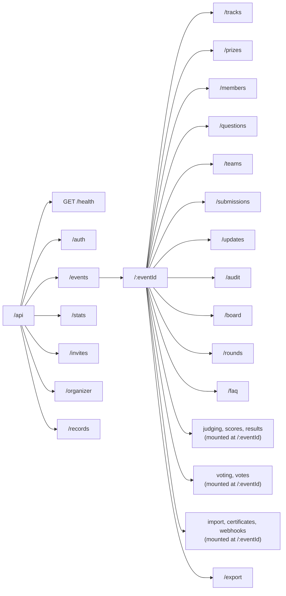
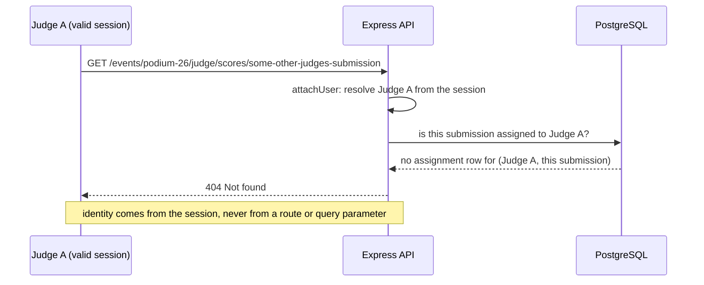

# API

REST over JSON. Base path `/api`. Every request body, query string and route parameter
that carries meaning is validated with Zod before a handler runs; a bad shape is a `400`
before any database query executes.

The machine-readable reference is an **OpenAPI 3.1 document**: [openapi.json](openapi.json), also served live at `GET /api/openapi.json`. It is generated from the running routes and the same Zod validators the server enforces, so it cannot drift. Regenerate the committed copy with `npm run openapi` in `server/`. It lists every path, method, path and query parameter, request body schema, the role a route requires (`x-required-role`) and whether it needs a session.

This document is a map of what exists and how authorization is layered on top of it.

## Conventions

- **Auth.** An HTTP-only session cookie, or `Authorization: Bearer <token>` for scripts
  and the test suite. Unauthenticated requests to a protected route get `401`.
- **Event scope.** Every event-scoped path takes `:eventId` as either a UUID or the
  event's slug; both resolve to the same event.
- **Errors.** `{ "error": { "code": "STABLE_CODE", "message": "human sentence" } }`, one
  shape everywhere, rendered by a single error middleware. A malformed id in the path is
  `404`, the same answer as an id that does not exist.
- **Idempotent writes.** `PUT` replaces a whole resource (a rubric, a voting config);
  `PATCH` merges named fields; `POST` creates or performs an action.
- **CSV and JSON exports** stream rather than buffer, so a large event does not hold the
  whole export in memory.

## Route map

### `/auth`

| Method | Path | Notes |
| --- | --- | --- |
| POST | `/auth/register` | Email + password. Also opens the first session. |
| POST | `/auth/login` | Constant-time against a dummy hash when the email does not exist. |
| POST | `/auth/magic-link` | Issues a single-use `SignInToken`. No email is sent: the link is written to the API log for the operator, and the response is the same whether or not the address exists. |
| POST | `/auth/magic-link/consume` | Redeems the token, opens a session. |
| POST | `/auth/logout` | Revokes the current session. |
| GET | `/auth/session` | The web client's session check: the caller's profile and event roles, or `{ user: null }` when signed out. Never 401. |
| GET | `/auth/me` | The caller's own profile. `401` when signed out. |
| PATCH | `/auth/me` | Update the caller's own profile only; never accepts a user id. |
| POST | `/auth/password` | Requires the current password; bumps `token_version`, ending every other session. |
| GET / DELETE | `/auth/sessions`, `/auth/sessions/:sessionId` | List or revoke the caller's own devices. Revoking someone else's session id is `404`, not `403`, so it does not confirm the id exists. |
| POST | `/auth/sessions/revoke` | Revoke every session but the current one. |
| GET | `/auth/me/activity` | The caller's own audit trail. |
| GET / PATCH | `/auth/me/notifications` | In-app notification preferences. |

### `/events` and `/events/:eventId/...`

| Method | Path | Notes |
| --- | --- | --- |
| GET | `/events` | Public listing, with mode/eligibility/status/theme filters. |
| POST | `/events` | Organizer capability required. |
| GET / PATCH | `/events/:eventId` | Private events 404 for non-members rather than 403, so their existence is not confirmed. |
| POST | `/events/:eventId/register` | Public registration: team-or-solo, experience, skills, `REGISTRATION`-stage custom questions, agreements. |
| `/tracks`, `/prizes`, `/members`, `/questions` | Standard CRUD, organizer/admin-only for writes. |
| `/teams`, `/teams/:teamId/invites` | Team creation, invite links (`token_hash` stored, plaintext shown once), transfer of ownership. |
| `/submissions`, `/submissions/mine*` | Draft, submit, withdraw, version history. Every write re-checks `submissionWindow(event)` server-side. |
| `/board`, `/board/requests` | Team-looking-for-people and people-looking-for-a-team listings, and the join-request handshake. |
| `/rounds`, `/faq` | Organizer-authored event timeline and FAQ. |
| `/updates`, `/updates/:id/read`, `/updates/read-all` | Announcements and per-user read receipts. |
| `/audit` | Organizer-only read of the event's audit trail. |
| `/export/*.csv`, `/export/event.json` | Organizer-only. Submissions, teams, judges, scores, results, audit, or the whole event as JSON. |

### Judging (mounted at `/events/:eventId`)

| Method | Path | Notes |
| --- | --- | --- |
| GET / PUT | `/rubric` | Locks once scoring starts (`locked_at`). |
| GET / POST / DELETE | `/assignments`, `/assignments/generate` | Manual and algorithmic assignment; the algorithm is a pure function, tested without HTTP. |
| GET | `/progress` | Coverage dashboard: started, complete, per-submission review count. |
| GET | `/judge/queue`, `/judge/scores/:submissionId` | **Scoped to the caller.** A judge id in the query string is never trusted; the server derives whose queue this is from the session. |
| PUT | `/judge/scores/:submissionId` | The weighted total is computed server-side from the stored rubric; a client-supplied total is ignored. |
| GET / POST | `/judge/groups`, `/judge/rankings` | Comparative mode: fetch this judge's groups, submit an order for one. |
| GET | `/rankings/standings` | Live Borda standings, organizer-only. |
| GET | `/judge/record` | The judge's own signed participation record. |
| GET | `/scores` | Organizer-only aggregate view. There is no `judgeId` parameter to trust or ignore: a non-organizer caller gets `403` regardless of what the query string says. |
| GET / POST | `/results/preview`, `/results/normalize`, `/results/runs`, `/results/publish`, `/results` | Normalization is a POST that creates an immutable `normalization_runs` row; reading a result is always from a stored run, never a live recomputation. |

### Voting (mounted at `/events/:eventId`)

| Method | Path | Notes |
| --- | --- | --- |
| GET / PUT | `/voting/config` | Access mode, method, credit budget, result hiding. |
| GET | `/voting/ballot` | A shuffled, per-voter-stable ballot order. |
| POST | `/votes` | Priced and validated server-side; see `JUDGING.md` for the quadratic-voting cost function. |
| GET | `/votes/ballots`, `/votes/results` | Organizer-only while `hideResults` is set and the window is open. |

### Integrations (mounted at `/events/:eventId`)

| Method | Path | Notes |
| --- | --- | --- |
| POST | `/import/roster` | CSV with `email` and optional `name`, `team`. Creates missing accounts, grants the role, places participants on teams (creating them), and reports every row it could not place. |
| GET | `/certificates/me`, `/certificates/summary` | Participation certificates. |
| GET / POST / PATCH / DELETE | `/webhooks`, `/webhooks/:id` | Organizer-managed subscriptions to any event-scoped audit action, or `*` for all; `GET` lists what is available. See `ARCHITECTURE.md` for delivery. |

### `/records` (global, not event-scoped)

| Method | Path | Notes |
| --- | --- | --- |
| GET | `/records/key` | The instance's public signing key, derived from `JWT_SECRET`. |
| POST | `/records/verify` | Recomputes a signature over a supplied payload; verification does not require trusting the platform's own badge. |

## A cross-event authorization failure, end to end

The scenario `CLAUDE.md` calls out explicitly: judge A tries judge B's endpoint.

