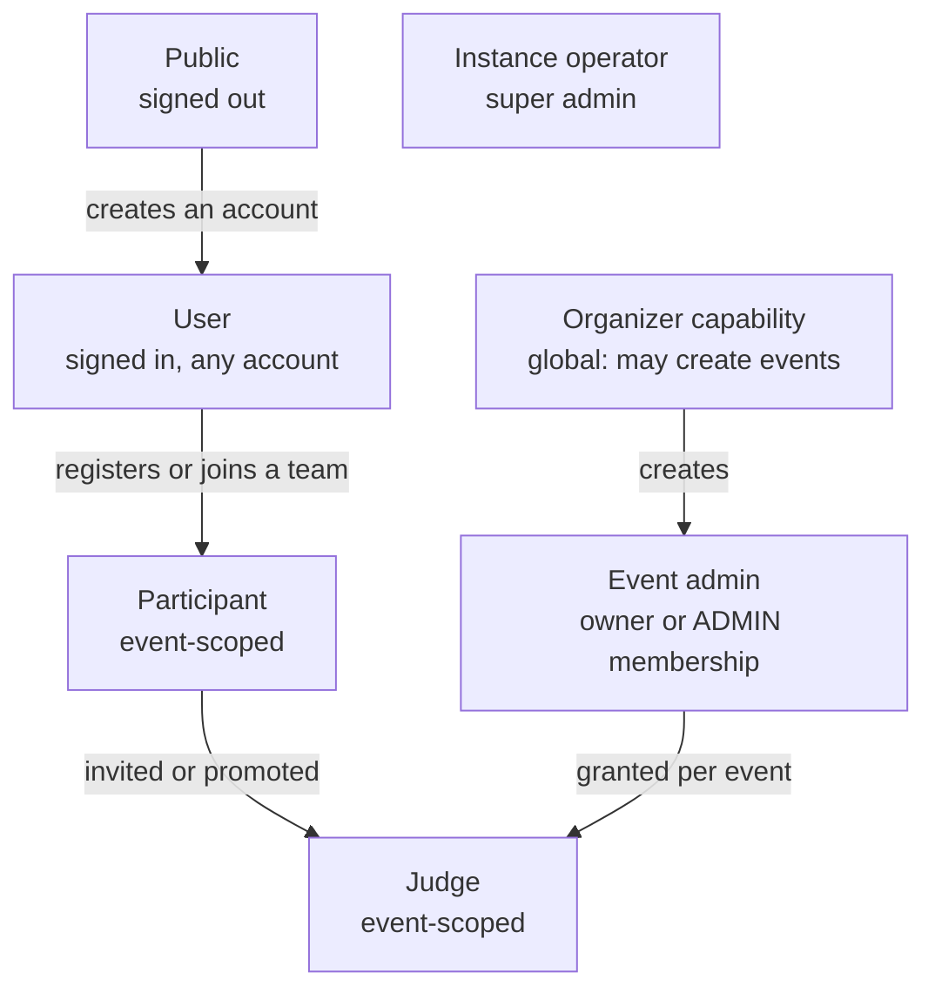
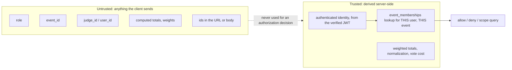
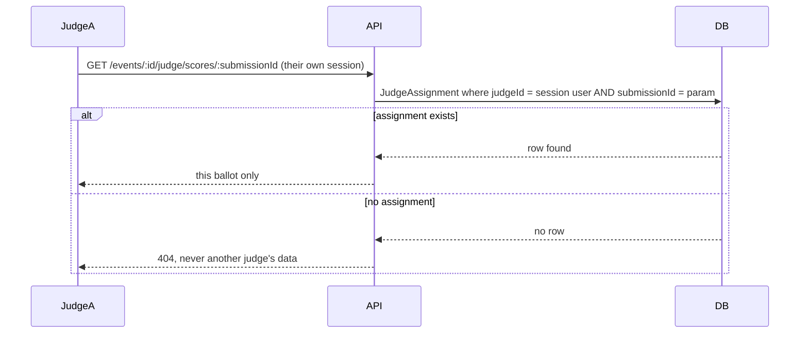

# Threat model

What this platform defends against, how, and what it deliberately does not defend
against. `ARCHITECTURE.md` explains the mechanisms; this document is about the adversary.

## Actors

Global account labels are **Public** (signed out), **User** (signed in) and **Organizer** (a user who may also create events). Participant, judge and event admin are event roles. None of these except identity itself and the organizer capability are global. A judge in
one event is a plain participant, or nothing at all, in another. See `DATA-MODEL.md` for
why that is a schema decision, not a UI convention.

## Assets, ranked by what breaks if they leak

1. **Judging integrity.** Another judge's scores, or a submission a judge was never
   assigned. This is the thing the whole product exists to protect.
2. **Account credentials and sessions.** Password hashes, JWTs, session tokens.
3. **Cross-event data.** A private event's roster, submissions or results, visible to
   someone with no membership in it.
4. **Voting identity.** Who voted for what, when a ballot was supposed to be anonymous to
   other participants.
5. **Availability.** The platform staying reachable through its own submission and
   voting windows.

## Trust boundaries

Every field in the "untrusted" box appears somewhere in a request. None of them cross
into an authorization decision or a stored score. `role`, `judge_id` and `event_id` in a
body or query string are read for *routing*, never for *permission*: the permission
question is always re-derived from the session and a fresh database lookup.

## STRIDE, applied to the parts that matter

| Threat | Where it could happen | Mitigation |
| --- | --- | --- |
| **Spoofing** | Claiming to be another judge or an organizer. | JWT signature verification, `token_version` and per-session revocation. Roles are never read from the token or the request, only looked up from `event_memberships` for the authenticated user. |
| **Tampering** | Client submits a `weightedTotal`, a vote `credits` figure, or a normalization result. | All of these are computed server-side from stored inputs and never accepted from the client. See `JUDGING.md` section 1 and 9. |
| **Repudiation** | An organizer denies publishing results, or a judge denies a score they cast. | `audit_logs` with actor, action, target and timestamp, append-only by database trigger and hash-chained so a rewrite is detectable. `normalization_runs` snapshots the exact inputs behind a published result. |
| **Information disclosure** | Judge A reads Judge B's scores. A participant reads a private event they are not a member of. A voter's identity leaks to another participant. | Every event-scoped query is filtered by the caller's own `event_memberships` row, derived server-side (see `API.md`'s worked example). Private events 404 rather than 403 for non-members. `voterKey` never appears in a response to another participant. |
| **Denial of service** | Vote or login flooding from one client. | Fixed-window rate limiting by hashed IP, and failed sign-ins by account and IP. The IP is the socket address unless `TRUST_PROXY` names a proxy, so a forged `X-Forwarded-For` cannot mint fresh IPs. Explicitly not a defense against a distributed attacker; see limits below. |
| **Elevation of privilege** | A participant calls a judge or organizer endpoint directly. | Middleware chain (`requireAuth` -> `loadEventContext` -> `requireJudge` / `requireEventAdmin`) runs before every handler; there is no code path that reaches a handler without it. Tested with `curl`-equivalent Supertest calls using a real, valid, wrong-role session, not by hiding a button. |

## Worked scenarios

### Judge isolation

### Cross-event access

An authenticated participant of Event A requests a resource in Event B. `loadEventContext`
resolves Event B, looks up `event_memberships` for `(userId, eventB.id)`, finds nothing,
and the handler never runs with an authorization decision based on Event A's membership.
A private Event B returns `404`; a public one returns whatever public visitors may see,
never more.

### Deadline tampering

Disabling the submit button, or replaying an old page load, changes nothing: every
mutating submission route re-evaluates `submissionWindow(event)` against the server
clock on every request, and a write outside the window is refused and logged as
`SUBMISSION_EDIT_REJECTED`.

## Named threats: stopped, reduced, or not addressed

Five abuse cases that matter for an evaluation platform. Each is marked **Stopped**,
**Reduced** (made harder or detectable, not impossible) or **Not addressed**, with the code
that backs the claim.

| Threat | Verdict |
| --- | --- |
| Sybil accounts | **Reduced** |
| Ballot stuffing | **Stopped** for signed-in voting, **Reduced** otherwise |
| Submission scraping | **Not addressed** (public by design) |
| Judge collusion | **Reduced** |
| Deadline gaming | **Stopped** |

### Sybil attacks (many fake accounts)

*Attack:* create many accounts to inflate community votes or fill a team board.

- **What exists.** `POST /auth/register`, `/auth/login` and `/auth/magic-link` share a limiter of
  20 attempts per 15 minutes per hashed client address (`authRateLimit`). Accounts are
  event-scoped for anything that matters: a new account holds no judge or admin role anywhere,
  because roles come only from `event_memberships` rows an organizer grants.
- **What does not.** Registration needs no email verification, because the platform sends no
  email (it must run offline). One person with several addresses or IPs can hold several accounts.
  Signed-in voting therefore counts accounts, not people, and a quadratic budget is granted per
  account. The vote panel flags several voters behind one address for a human decision.
- **Recommendation.** For a vote that decides a prize, use signed-in voting, read the flags, and
  keep the credit budget small. Restricting voters to registered participants is not implemented.

### Ballot stuffing

*Attack:* cast many ballots as one voter, or replay a ballot.

- **Stopped for identified voters.** A voter is identified server-side (`resolveVoter`): account id,
  verified-by-address email, or hashed IP. `votes` is unique per `(event, voter key, submission)`
  and a new ballot **replaces** the previous one in a transaction, so re-submitting cannot stack.
  A client cannot nominate the identity it votes as. Own-team votes and cross-event submissions
  are refused. Weight, credits, budget and method are validated and priced on the server; a client
  `credits` figure is ignored. The method and budget lock once a ballot exists.
- **Reduced elsewhere.** Ballots are limited to 60 per hour per hashed address. Open-link voting
  identifies a voter only by address, and email-gated voting proves nothing about who owns the
  address, so a determined attacker with many addresses succeeds. Tallies stay hidden until the
  window closes, which removes the feedback an attacker needs to tune a campaign. Every rejected
  ballot is audited (`VOTE_REJECTED`).

### Submission scraping

*Attack:* bulk-harvest projects, descriptions and links.

- **Not addressed.** The gallery is public by design, so there is nothing to protect from a visitor.
  Read routes have no rate limit. Drafts are never returned to the public, private events return
  404, and results stay hidden until publication, but a published gallery can be crawled.
- **If it matters.** Put a reverse proxy with rate limiting in front, or make the event private or
  link only. The embeddable gallery exposes only what the public gallery already shows.

### Judge collusion

*Attack:* judges coordinate, or a judge favours a friend.

- **Reduced.** A judge is never assigned their own team's project (`assignment` refuses it), and
  track scope narrows what a judge can be assigned or read. Judges cannot see each other's scores
  (isolation is enforced in the API, see above), so they cannot copy a running total or react to
  it. Each project is read by several judges, and per-judge normalization limits how far one
  harsh or generous judge moves a ranking. The organizer can see each judge's mean and spread in
  the calibration table, and every score is audited.
- **Not addressed.** Nothing detects two judges who agree suspiciously often, and outside
  relationships (a judge who knows a team) are not modelled. Normalization damps a lone outlier
  but does not stop two or three coordinating judges on a small panel.

### Deadline gaming

*Attack:* edit after the deadline, or replay a stale page.

- **Stopped.** Every mutating submission route re-evaluates `submissionWindow(event)` against the
  server clock. A write outside the window is refused and audited (`SUBMISSION_EDIT_REJECTED`).
  Client time is never read. Locked submissions refuse writes from the team.
- **Remaining path.** An event admin can move a deadline or unlock, which is by design and is
  recorded in the audit log with the actor and the old and new values.

## Known limitations

Stated plainly, per `CLAUDE.md`'s instruction to be honest about tier boundaries rather
than claim coverage the code does not have.

- **Rate limiting is per-process by default.** A horizontally scaled deployment sets
  `RATE_LIMIT_STORE=postgres` so replicas share windows through the database, with no Redis.
  Sign-in limits count failures per account and address, so a crowded venue behind one NAT
  address is not locked out; see `ARCHITECTURE.md`.
- **Email-gated and open-link voting do not prove identity.** Neither mode defends
  against a determined attacker with several addresses or IPs. The honest recommendation
  for anything that decides a prize is `AUTHENTICATED` voting; see `JUDGING.md` section 9.
- **No email delivery.** Magic links and invites are shown on-screen rather than mailed,
  because the platform runs with the network off by requirement. A self-hosted deployment
  relays them however fits its own environment.
- **Webhook retries are bounded.** A delivery is retried five times over about two and a half
  hours, then marked failed for a manual retry. Outbound requests refuse private and internal
  addresses (SSRF), and signatures bind a timestamp and delivery id (replay).
- **The acceptance checker tokens in `.dogfood.toml` are public.** The checker never signs in,
  so the seed stores four fixed API tokens for fixture accounts. Each is scoped to the fixture
  event: inside `sample-hack-2026` it acts as its account, anywhere else it authenticates as
  nobody, and it never carries the account's organizer capability, so it cannot create events.
  `FIXTURE_TOKENS=false` skips them and `DELETE /api/auth/tokens/:id` revokes one. Session and
  record-signing secrets are generated per instance on first boot, so knowing the repository
  does not let anyone forge a session.
- **No anomaly detection.** Flagged voting activity (shared IP across voter keys) is
  surfaced to the organizer for a human decision; nothing is auto-blocked, so a patient
  attacker below the flagging threshold is not caught by the platform itself.
