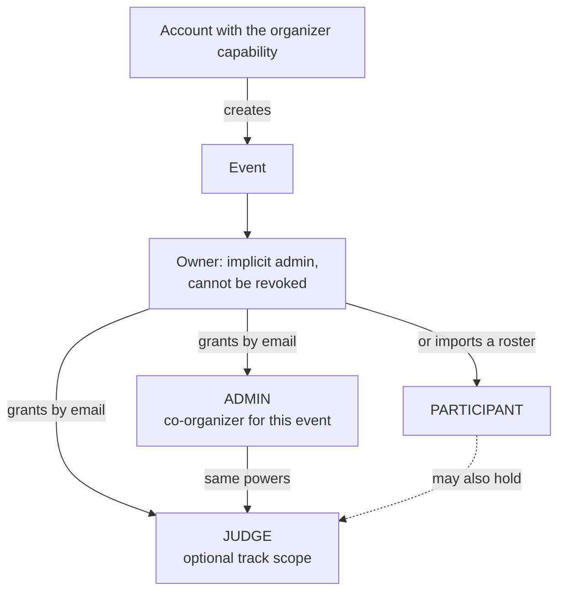

# The organizer role

What an organizer can do, how the organizer capability differs from an event admin, and
how an organizer decides who is a participant, a judge or an admin in each event.

Read this with `DATA-MODEL.md`, `ARCHITECTURE.md`, `SECURITY.md` and `JUDGING.md`. The
participant side is in [user.md](user.md).

## Notation

Two different vocabularies, kept apart on purpose:

| Level | Labels | Meaning |
| --- | --- | --- |
| **Account** (global) | **Public**, **User**, **Organizer** | Public is signed out. User is any signed-in account. Organizer is a user who may also create events. Shown in the site header and on the profile |
| **Event** (per event) | **Participant**, **Judge**, **Admin**, **Owner** | What the account is *in one particular event*. Shown in the event shell, never in the global header |

A user is never "a participant" or "a judge" in general. Those words only make sense with an
event attached.

## Four words that are easy to confuse

| Term | What it is | Scope |
| --- | --- | --- |
| **Organizer capability** | A flag on the account (`users.is_organizer`) that lets it create events. It is chosen when the account is created ("I will create and run events") | Global, but grants no rights in anyone else's event |
| **Event owner** | The account that created an event | One event. Always an event admin there, and that admin role cannot be revoked |
| **Event admin** | An account that is the owner, or holds an `ADMIN` membership in the event | One event |
| **Instance operator** | An account flagged `is_super_admin`, for platform maintenance | Acts as an event admin everywhere; not an event role, and not something the interface grants |

So "organizer" in everyday speech usually means an **event admin of a particular event**.
Only the *capability* to create events is global.

## Who decides what

The organizer decides the **shape of the event and who holds each role in it.** Nobody
gets a role by asking the server for it, and a client can never nominate its own role.

| Role in an event | How an account gets it | Who can give it |
| --- | --- | --- |
| Participant | Registers, or accepts a team invite, or is imported from a roster | The account itself (within the rules the organizer set), or an event admin |
| Judge | Granted by email, with an optional track scope | Event admin only |
| Admin | Granted by email | Event admin only |

Granting by email requires the account to **already exist**. The platform sends no email,
so an unknown address is reported back rather than invited. Tell the person to create an
account, then grant the role. The same account can hold several roles in one event, but
never the same role twice.

## What an organizer can do

Every action below is enforced on the server as "event admin of this event". A hidden
button is not the boundary; a direct API request from a non-admin receives an
authorization failure.

### Create and configure the event

- **Create an event** (needs the organizer capability): name, tagline, description, theme
  tags, visibility (public, unlisted or private), timezone, mode and place, team size
  limits, eligibility, reviews per submission. Timeline dates must be coherent.
- **Edit everything later** (`/events/[slug]/settings`): the same fields, plus status.
- **Dates**: registration open and close, submissions open and deadline, judging open and
  close, voting close. Each is enforced by the server clock.
- **Tracks**, **prizes** (optionally tied to a track), **sponsor challenges**,
  **custom questions** for registration and for submissions, **rounds** and their windows,
  **FAQ**, and **people** (speakers, mentors, partners).
- **Event updates**: post announcements, pin them, edit or delete them. Participants read
  them and mark them read.

### Event lifecycle

Status moves through Draft, Announced, Registration open, Submissions open, Judging, Voting,
Results published and Archived. It reports where the event is; the enforced boundaries are
the dates and windows above. Create it with **Save as draft** (private, no registrations) or **Publish event**, and move it between stages from **Settings, Event status**. A **draft** event cannot take registrations or submissions, and is invisible (404) to anyone without a role in it.

**Visibility** is set in Settings too: **Public** (listed on Discover), **Link only** (unlisted, open to anyone with the link) or **Private** (invisible without a role). **Share** the event with the copy-link box in Settings, or right after creating it.
A **private** event is invisible, returning "not found", to anyone with no membership in it.

### Manage people and roles (`/events/[slug]/roles`)

- Grant `JUDGE` or `ADMIN` by email; grant `PARTICIPANT` in bulk by importing a CSV roster
  (up to 1,000 addresses at a time; unknown or invalid addresses are reported, not invited).
- Give a judge a **track scope**, so they only ever see submissions in those tracks, and
  change it later. An empty scope means all tracks.
- Revoke a role. The owner's own admin role is protected and cannot be revoked.
- Every grant and revoke is written to the audit log.

### Teams and submissions

- View every team and every submission, including drafts (`/submissions/all`).
- **Lock** a submission so it can no longer be edited. Locked writes are refused and
  audited.
- Moderate comments: **hide** a comment (kept for the record, hidden from the public,
  with an optional reason).

### Judging

- **Rubric**: criteria with weights that must total exactly 100 (`/events/[slug]/settings`),
  or comparative mode with a group size. The rubric is **locked once any ballot exists**,
  because changing a weight would silently rewrite cast ballots.
- **Assignment** (`/events/[slug]/assign`): generate automatically (balanced across the
  panel, honouring track scope, never giving a judge their own team's project), assign or
  remove individual pairs by hand, or clear all. An assignment that has already been scored
  cannot be removed.
- **Progress** (`/events/[slug]/manage`): who has not started, who is behind, which projects
  are short of reviewers, per-judge completion.
- **Scores**: the organizer alone can read the full score set and export it.

### Results

- **Preview** the standings under each method (raw, per-judge z-score, rank average).
- **Run normalization**: stored as an immutable, reproducible run. See `JUDGING.md`.
- **Publish and unpublish** (`/events/[slug]/results`): publishing requires a prior
  normalization run and opens a review dialog that warns about judges with no evaluations,
  thinly reviewed projects and unranked projects. Until results are published, aggregate
  scores are organizer-only.

### Community voting

- Configure method (single, or quadratic with a credit budget), access mode (open link,
  email-gated, or signed-in), whether judges and admins may vote, and the closing time.
- Watch standings while voting runs; the public sees them only after it closes.
- Review flagged activity (for example shared addresses across voter keys). The platform
  flags for a human decision and blocks nothing automatically.

### Operations

- **Audit log**: append-only, readable, with hashed IP addresses.
- **Exports**: submissions, teams, judges, scores, results and audit as CSV; the whole
  event as JSON.
- **Webhooks**: HMAC-signed, for submission submitted, score submitted, judge assigned,
  results published, update posted, vote cast and round changed, with a delivery log.
- **Certificates**: see who took part and issue certificates.

## What an organizer cannot do

- **Act in someone else's event.** The capability to create events confers nothing in an
  event owned by another account unless that owner grants `ADMIN`.
- **Read another judge's private work as that judge.** Admin access is a separate,
  organizer-only view; it does not impersonate a judge.
- **Change the rubric after scoring starts.**
- **Assign a judge their own team's project**, or a project outside their track scope.
- **Remove a scored assignment.**
- **Edit a submission's content for the team.** Organizers lock; teams write.
- **Lock themselves out.** The owner's admin role cannot be revoked.
- **Send email.** Invite links and sign-in links are relayed by hand.

## Permission summary

| Capability | Owner | Event admin | Judge | Participant |
| --- | :-: | :-: | :-: | :-: |
| Create an event | yes, with the organizer capability | no | no | no |
| Edit settings, dates, tracks, prizes, questions, rounds | yes | yes | no | no |
| Grant and revoke roles, set track scope | yes | yes | no | no |
| Import a roster | yes | yes | no | no |
| Configure the rubric (until first ballot) | yes | yes | no | no |
| Generate and edit assignments | yes | yes | no | no |
| Score assigned projects | only if also a judge | only if also a judge | yes, own queue | no |
| Read all scores and progress | yes | yes | no | no |
| Run normalization, publish results | yes | yes | no | no |
| Configure voting, see live tallies | yes | yes | no | no |
| Lock a submission, hide a comment | yes | yes | no | no |
| Export data, read audit log, manage webhooks | yes | yes | no | no |
| Revoke the owner's admin role | never | never | never | never |

## Running an event, in order

1. **Create** the event (draft). Set dates, tracks, prizes, custom questions.
2. **Configure the rubric.** Weights total 100.
3. **Grant judge roles** by email, with track scopes if needed. Optionally add co-admins.
4. **Open registration.** Participants register or join by invite.
5. **Open submissions.** Teams draft and submit. Watch the dashboard for empty teams.
6. **Assign judges.** Generate, review the balance, adjust by hand.
7. **Judging window.** Track progress, message judges who are behind (the dashboard offers
   a copyable reminder; the platform sends no email).
8. **Normalize.** Preview each method, run one, check the methods agree.
9. **Publish** after the review dialog. Post an update announcing the winners.
10. **Voting** may run alongside; its tally is separate from judging.
11. **Archive.** Certificates and signed judge records can be drawn.

## Where each thing lives in the interface

| Task | Route |
| --- | --- |
| Your events, with progress | `/organizer` |
| Create an event | `/events/new` |
| Next required action, judges behind, coverage | `/events/[slug]/manage` |
| Assign judges | `/events/[slug]/assign` |
| Rounds and windows | `/events/[slug]/rounds` |
| Standings, methods, publish | `/events/[slug]/results` |
| Voting setup and tallies | `/events/[slug]/voting` |
| Announcements | `/events/[slug]/updates` |
| Who holds which role | `/events/[slug]/roles` |
| Event settings, webhooks | `/events/[slug]/settings` |
| Winners page | `/events/[slug]/winners` |

## Related documents

- `DATA-MODEL.md`: the membership table and the constraints behind these rules.
- `ARCHITECTURE.md`: request path, authorization, deadline enforcement, audit log.
- `SECURITY.md`: judge isolation, cross-event access and known limitations.
- `JUDGING.md`: rubric, assignment, normalization, ties, incomplete judging, voting.
- `API.md`: the routes behind each action.
- [user.md](user.md): what participants, and participants who judge, can do.
