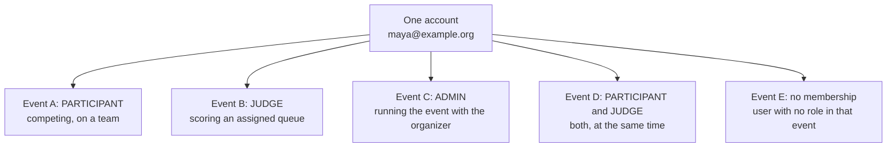

# The user and the participant role

What a signed-in **user** can do, who a **participant** is in a given event, and how one
account ends up holding other roles (judge, event admin) in other events, or even in the
same one.

Read this with `DATA-MODEL.md` (why roles are per event), `ARCHITECTURE.md`
(authorization) and `SECURITY.md` (what the server refuses). The organizer side is in
[organizer.md](organizer.md).

## Notation

Two different vocabularies, kept apart on purpose:

| Level | Labels | Meaning |
| --- | --- | --- |
| **Account** (global) | **Public**, **User**, **Organizer** | Public is signed out. User is any signed-in account. Organizer is a user who may also create events. Shown in the site header and on the profile |
| **Event** (per event) | **Participant**, **Judge**, **Admin**, **Owner** | What the account is *in one particular event*. Shown in the event shell, never in the global header |

A user is never "a participant" or "a judge" in general. Those words only make sense with an
event attached.

## The one idea to hold on to

A **participant is not a kind of account.** It is a row in `event_memberships` that says
"this account takes part in this event". The same account can be:

Nothing about Event A changes what Maya can do in Event B. The server never asks "what
is this person"; it asks "what is this person **in this event**".

## How an account becomes a participant

Signing up does not make anyone a participant of anything. There are two ways in, and
both create the same `PARTICIPANT` membership for that one event.

| Route | What happens | Guards enforced by the server |
| --- | --- | --- |
| Register for the event (`/events/[slug]/register`) | The account is registered as a participant, optionally with a preferred track, skills, experience and answers to the organizer's registration questions | Event is not a draft. Registration has opened and has not closed. The account is not already registered. Every required question is answered. If the form is detailed, the rules and code of conduct are both accepted. A chosen track belongs to this event |
| Accept a team invite link (`/invite/[token]`) | Joining the team registers the account for the event in the same step | Link is valid, not revoked, not expired, not used up. Registration has not closed. The account is not already on a team in this event. The team is not full |

Registration is rejected with a plain message for each failure; the form never has to be
trusted to have pre-checked anything.

An account can also be made a participant without doing either, by an organizer importing
a roster (see the organizer guide). The result is the same membership row.

## What the role includes

### Before and during registration

- Browse the public gallery and event pages as anyone, signed in or not, can. A **private** event is
  invisible, and returns "not found", to accounts with no membership in it.
- See the event overview: dates, tracks, prizes, rules, FAQ, rounds, challenges, people.

### Teams

A team belongs to one event, and an account is on at most one team per event.

| Action | Who may do it | Notes |
| --- | --- | --- |
| Create a team | Any participant not already on a team | Becomes the team **owner** |
| Invite people with a link | Team owner only | Links can have a use limit and an expiry, can be revoked, are stored hashed and are shown once. Invitations are not emailed, so the owner relays the link |
| Post the team on the board ("looking for members") | Team owner | Board is read-only once registration closes |
| Post yourself as looking for a team | A participant without a team | Private until both sides agree |
| Ask to join a team, or invite a person | Participant / team owner | Two-sided handshake: nothing changes until the other side accepts. Only the other side may answer |
| Remove a member, or leave | Owner removes anyone; a member may leave | The owner must transfer ownership before leaving |
| Transfer ownership | Team owner | To another member |

Team size is bounded by the event's maximum. Team changes stop when registration closes.

### The submission

One submission per team, edited by **any member** of that team (participant role plus
membership of the owning team are both checked, in that order).

- Draft freely and autosave until the deadline. Each save is recorded in the version
  history.
- **Submit** only when the required fields and the organizer's required questions are
  complete; the server checks this, not the form.
- **Withdraw** a submitted project while the window is still open.
- Fields: name, tagline, description, thumbnail, image gallery, demo video, repository,
  live link, tech tags, track, challenges entered, answers to custom questions.
- Every write goes through the same server-side window check. After the deadline, or once
  an organizer **locks** the submission, the project is read-only, and the rejected write is
  recorded in the audit log. The countdown in the interface is decoration.

Only submitted projects appear in the public gallery. Drafts are visible to the team and to
organizers only.

### Community participation

| Action | Rule |
| --- | --- |
| Comment on a submitted project | Any signed-in account. Rate limited. Organizers may hide a comment, and you may delete your own |
| Vote in community voting | Allowed according to the event's access mode (open link, email-gated, or signed-in). You cannot back your own team's project. Judges and organizers of the event are excluded unless the organizer allows them |
| See community results | Hidden until voting closes |
| Read event updates, mark them read | Any account; organizers post them |
| Draw a participation certificate | Any account holding a role in the event. The certificate carries a code that anyone can verify at `/verify` |

### What a participant cannot do

- See any judge's scores, another judge's queue, or aggregate standings before results are
  published.
- Read another team's draft or edit another team's submission.
- Grant roles, edit event settings, assign judges, run normalization or publish results.
- Pick their own role. A participant cannot promote themselves; only an organizer or event
  admin grants `JUDGE` or `ADMIN`, per event.

## A participant who is also a judge

An organizer can grant the `JUDGE` role to any existing account **on top of** an existing
`PARTICIPANT` membership. The uniqueness rule is `(event, user, role)`, so holding both
roles is legal and the two never merge.

What changes for that person in that event:

- They gain the **judge console** (`/events/[slug]/judge`) with their own queue.
- They keep their team and their submission.
- They keep their own submission out of their queue. The assignment engine never gives a
  judge a project from their own team, and a manual assignment of it is rejected.
- They cannot cast community votes unless the organizer set the event to allow judges.
- They may be limited to certain tracks (`track_scope`). Outside that scope, a project is
  unreachable even by direct id.

What does **not** change: a judge still cannot see another judge's scores, and cannot see
aggregate scores until results are published.

A judge may also draw a **signed judge record**: a document, signed by the platform, that
states which projects they evaluated. It contains no one else's scores and can be checked
by anyone at `/verify`.

## A participant who is also an event admin

An organizer can grant `ADMIN` to any existing account. An event admin can do everything
the organizer can inside that event (see [organizer.md](organizer.md)), except that the
event owner's own admin role can never be revoked.

An admin may still be a participant and a judge in the same event. Expect the checks to
stack: being an admin does not exempt anyone from the self-review rule, and by default
admins do not vote in community voting.

## Permission summary

Everything is per event. "Own" means the account's own team, queue or ballots.

| Capability | Public | Participant | Judge | Event admin | Owner |
| --- | :-: | :-: | :-: | :-: | :-: |
| Browse gallery and event pages (public events) | yes | yes | yes | yes | yes |
| Register, join teams, edit own team's submission | no | yes | only with the participant role as well | only with the participant role as well | only with the participant role as well |
| Comment on submitted projects | no (sign in) | yes | yes | yes | yes |
| Community vote | per access mode | yes | organizer decides | organizer decides | organizer decides |
| Score an assigned queue | no | no | yes, own queue only | no | no |
| Read another judge's scores | no | no | no | yes (organizer-only view) | yes |
| Assign judges, edit rubric, run normalization, publish | no | no | no | yes | yes |
| Grant or revoke roles | no | no | no | yes | yes (owner's admin role is protected) |
| Create a new event | no | no | no | only with the organizer capability | only with the organizer capability |

## Where each thing lives in the interface

| Task | Route |
| --- | --- |
| See every event you take part in, grouped by what needs you now | `/my-events` |
| Register for an event | `/events/[slug]/register` |
| Find or form a team | `/events/[slug]/teams` |
| Write and submit the project | `/events/[slug]/submit` |
| Vote | `/events/[slug]/vote` |
| Read updates | `/events/[slug]/updates` |
| Judge (if granted) | `/events/[slug]/judge` |
| Certificate or signed record | `/events/[slug]/certificate`, `/verify` |
| Profile, sessions, notifications | `/profile`, `/settings` |

The header shows only the account label (Public, User or Organizer). The event shell shows the role held **in the current
event**, so someone who competes in one event and judges another sees the right role in
each.

## Common questions

**Can I judge an event I am competing in?** Only if the organizer grants you the judge
role there, and even then you never receive your own team's project.

**Do I need a second account to judge another event?** No. One account, many memberships.

**Why can't I choose to become a judge?** Judging integrity depends on the organizer
deciding who sits on the panel. A role is granted by an event admin, by email, to an
existing account.

**I was invited, but I have no account.** Create one first. The platform does not email
invitations and cannot invite an address that has no account; the organizer grants the role once the
account exists.

**Does the organizer capability make me an organizer of every event?** No. It only lets an
account create events of its own. It confers no rights in anyone else's event.

## Related documents

- `DATA-MODEL.md`: the membership table and why the role is a property of the event.
- `ARCHITECTURE.md`: how every request derives your role from the database.
- `SECURITY.md`: judge isolation and cross-event access, worked through.
- `JUDGING.md`: assignment, normalization and community voting.
- [organizer.md](organizer.md): the other side of every action described here.
